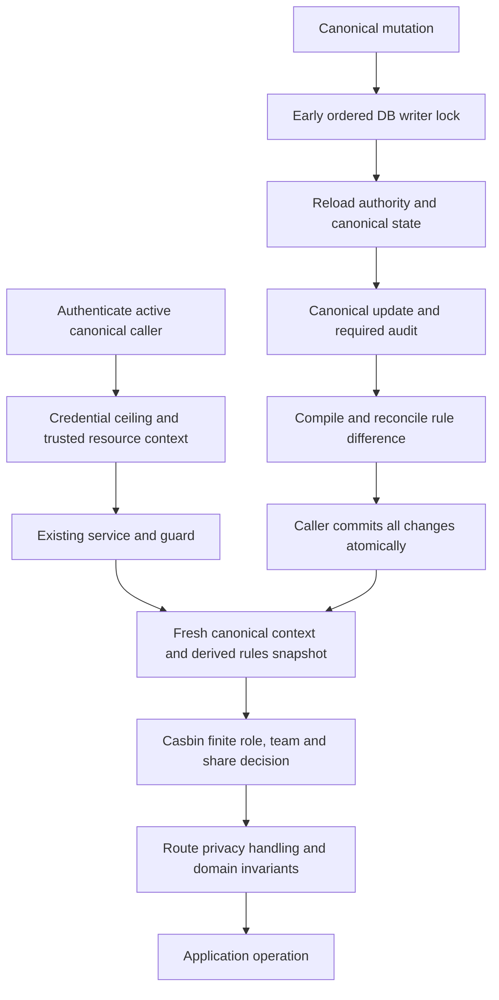

# RBAC & Sharing Implementation Audit

## 1. Final Verdict

**All six authorized follow-up items are DONE.** The initial audit examined `main` at `b2b2172106a95367ebaf320c10b558e9f23537e9`; the completed follow-up is verified on `944b35148d0ef8d72c6613b5b0164b2f32799bee`, September 9, 2026. The broader whole-plan/upstream-compatible verdict remains `NOT DONE` for the separately classified contract differences and conditional decisions below.

The canonical Casbin implementation, scoped roles, team management, targeted grants, project inheritance, conditional saves, and collaboration UI are implemented. The authorized follow-up closes exactly the original six `PARTIALLY_DONE` rows: AUTH-07, TEST-02, TEST-04, TEST-05, TEST-06 and DOC-02. Final combined CI passes 70 jobs with eight conditional skips and no failed/cancelled jobs. Fork/default conflicts and external proposals remain separately classified. The original eight-journey local pass did not enable IBM assertions; the final hosted follow-up supplies that evidence.

**Latest scope instruction:** the user excluded further security/secrets content and asked to continue with the remaining plan items. EXEC-02/03/05/06 are therefore deferred as `OUT_OF_SCOPE` for this report, with detailed security reproductions omitted. This is not a claim that those excluded boundaries are resolved or validated. The verdict below concerns the remaining requested plan/architecture/functionality/validation work.

The initial audit changed only this report. The subsequent authorized implementation adds bounded inventory validation, membership-default regression coverage, administration accessibility coverage and a page-level landmark correction. It also makes the inherited backend tests' compatibility mode explicit while preserving required enforcement coverage, and clarifies the existing membership documentation. The user's pre-existing deletion of revision 002 remains preserved; revision 003 remains unchanged.

**Requirement totals:** 117 individual requirements; related rows may share one underlying cause.

| Status | Count |
| --- | ---: |
| `DONE` | 97 |
| `PARTIALLY_DONE` | 0 |
| `MISSING` | 0 |
| `NEEDS_MODIFICATION` | 0 |
| `ASSUMPTION` | 2 |
| `EXTERNAL_DECISION_REQUIRED` | 4 |
| `CONFLICT` | 3 |
| `OUT_OF_SCOPE` | 11 |

`DONE` means the particular requirement has a traced implementation and relevant evidence; it does not certify every runtime surface, deployment configuration, or the entire release. `NEEDS_MODIFICATION` identifies existing incorrect behavior. `PARTIALLY_DONE` identifies a concrete unfinished implementation/proof deliverable. Community proposals and historical ideas are classified separately from accepted requirements.

## 2. Sources Reviewed

### Repository and authoritative plan

- [Revision 003](<auth_share_implementation_plan_updated_latest 003.md>), revision 1.7, all sections, including the PC-01–PC-26 and TX-01–TX-18 contracts, eight journeys, work packages, and completion checklist. SHA-256: `BFE357D1957961D625E24C7E70ED2B52AD697DD71C29E0D4B6D435E11350747B`.
- Current checkout: `E:\ABC\langflow`, branch `main`, commit [`b2b2172106a95367ebaf320c10b558e9f23537e9`](https://github.com/waqoor/langflow/commit/b2b2172106a95367ebaf320c10b558e9f23537e9), subject `finalized UI`.
- [Repository instructions](AGENTS.md), particularly lines 108–145. They explicitly describe a fork with Casbin installed, registered, and enabled by default. That explains the current choice but does not erase the audit's required comparison with revision 003.
- Current upstream `main` was resolved through GitHub to `595cd72a2b2021f2375fa31109af02d20bb17648`. The local upstream tracking ref was older (`e3abffc1b8da1e38cc2f21a9cf1b23b4a21c15d5`); it was not presented as current upstream.
- Upstream [authorization factory](https://github.com/langflow-ai/langflow/blob/595cd72a2b2021f2375fa31109af02d20bb17648/src/backend/base/langflow/services/authorization/factory.py), [pluggable services](https://github.com/langflow-ai/langflow/blob/595cd72a2b2021f2375fa31109af02d20bb17648/src/lfx/PLUGGABLE_SERVICES.md), and `AGENTS.md` were fetched and compared with the fork. Upstream retains the pass-through default and the registration boundary.
- Current models, migrations, compiler/model/store/service, identity and resource lifecycle writers, route guards/fetch/listing, public transports, execution, frontend queries and controls, tests, CI selection/aggregation, and documentation were inspected. Searches included execution/build, monitoring, jobs, variables, providers, files, memory, and project code outside directories named `auth` or `share`.

### Issue 14932: description and every comment

The [full issue](https://github.com/langflow-ai/langflow/issues/14932) was open at review time. The paginated GitHub API returned **10 comments**, matching the issue's comment count. All ten were read chronologically, including the new September 9 comment. Association labels alone were not treated as proof of decision authority.

| Ref | UTC date | Speaker / statement type | Material content and disposition |
| --- | --- | --- | --- |
| C1 | 2026-09-05 03:45:14 | tlyyxjz; community proposal | [5549130236](https://github.com/langflow-ai/langflow/issues/14932#issuecomment-5549130236): recommends PyCasbin, a DB adapter, and domains. Useful design input, not acceptance of a particular deployment. |
| C2 | 2026-09-05 09:16:57 | yazeedhasan97; contribution author refinement | [5550828627](https://github.com/langflow-ai/langflow/issues/14932#issuecomment-5550828627): canonical `authz_*`, the existing service boundary, and one decision system. Retained. |
| C3 | 2026-09-05 15:16:09 | tlyyxjz; initial model proposal | [5552751354](https://github.com/langflow-ai/langflow/issues/14932#issuecomment-5552751354): three-field/team-rooted model, team ownership/personal-team questions, wildcard concepts, Go assertions. Conflicting parts are superseded by C4/C6/C8. |
| C4 | 2026-09-05 17:33:11; edited 17:47:16 | author correction | [5553562885](https://github.com/langflow-ai/langflow/issues/14932#issuecomment-5553562885): retain four fields, canonical ownership, teams as principals, separate management/resource authority, bounded administration, credential ceilings. Retained. |
| C5 | 2026-09-06 07:29:13 | community revised proposal | [5557743041](https://github.com/langflow-ai/langflow/issues/14932#issuecomment-5557743041): literal domains/exact actions and more fixtures, but proposed Python team decisions, inferred creation, and eventual reload semantics remain corrected by C6/C8. |
| C6 | 2026-09-06 18:46:37 | author correction | [5561358361](https://github.com/langflow-ai/langflow/issues/14932#issuecomment-5561358361): team authorization in the same selected enforcer, scoped/parent role handling, explicit creation, all active member roles, canonical ownership, atomic lifecycle synchronization. Retained. |
| C7 | 2026-09-07 02:26:54 | community fixtures/questions | [5564198529](https://github.com/langflow-ai/langflow/issues/14932#issuecomment-5564198529): reports 368 Go/Python assertions and asks about platform operations, permission vocabulary, team domain, and create shape. Counts are contributor claims, not this repository's application/DB proof. |
| C8 | 2026-09-07 09:53:46 | latest author architectural decision | [5568834738](https://github.com/langflow-ai/langflow/issues/14932#issuecomment-5568834738): optional registered in-process backend candidate; upstream packaging/adoption remains pending. Answers C7: finite platform/team actions, role workspace intersection, literal global team domain, `flow:*`/`create`, fresh admission, differential projection, early writer ordering, and suspended-team management. These questions are no longer open semantic gaps. |
| C9 | 2026-09-07 10:37:02 | community acknowledgement | [5569357822](https://github.com/langflow-ai/langflow/issues/14932#issuecomment-5569357822): agrees with the clarified shape and offers further review. Does not constitute upstream maintainer adoption. |
| C10 | 2026-09-09 03:44:59 | blev8824-ai; new community recommendation | [5595459092](https://github.com/langflow-ai/langflow/issues/14932#issuecomment-5595459092): proposes recording owner and executor for each run and links AgentKey. No later author/maintainer acceptance was present. Assessed as EXT-03, not retroactively promoted into a mandatory feature. |

### Related discussions and architecture references

| Source reviewed | Relevance / authority / boundary |
| --- | --- |
| [Issue 1864](https://github.com/langflow-ai/langflow/issues/1864), description and all 21 comments | Historical broad collaboration request: authentication, roles, sharing, real-time collaboration, and history. [May 8, 2024 direction](https://github.com/langflow-ai/langflow/issues/1864#issuecomment-2100508549) favored Casbin. This does not approve this fork's current packaging or add every historical feature to revision 003. |
| [1735](https://github.com/langflow-ai/langflow/issues/1735) and [1725](https://github.com/langflow-ai/langflow/issues/1725), descriptions and empty comment collections | Async UI updates/collaborative editing and flow history/version recovery. Followed to establish relevance; live co-editing and restoration remain outside this plan. |
| [2855](https://github.com/langflow-ai/langflow/issues/2855), description and all 36 comments | SSO/OIDC demand and linked implementations. Distinguish authentication-provider work from this authorization implementation. |
| [PR 7346](https://github.com/langflow-ai/langflow/pull/7346) and discussion | Open and unmerged; broad SSO proposal. Maintainer feedback requested narrower contributions. Author later reported it out of sync and stopped updating it. Casdoor discussion does not select a replacement identity/policy platform here. |
| [PR 9020](https://github.com/langflow-ai/langflow/pull/9020) and discussion | Open and unmerged Google/Microsoft login proposal; community deployment/migration feedback. Not an accepted replacement for current authentication. |
| [PR 11399](https://github.com/langflow-ai/langflow/pull/11399) and relevant chronological discussion | Open and unmerged multi-provider SSO proposal. [April 25 maintainer direction](https://github.com/langflow-ai/langflow/pull/11399#issuecomment-4319999629) points to pluggable services. Provider login UI and email-based cross-provider account linking from this proposal are not accepted RBAC requirements. |
| [Discussion 11586](https://github.com/langflow-ai/langflow/discussions/11586), two comments and two replies; [8374](https://github.com/langflow-ai/langflow/issues/8374) | Conflicting community SSO configuration claims. The replies explicitly report that suggested variables did not work. They are not an authoritative deployment contract. |
| [PR 12917](https://github.com/langflow-ai/langflow/pull/12917) | Merged WxO token/global-variable integration. Its title must not be interpreted as delivery of generic end-user OAuth login. |
| [PR 13153](https://github.com/langflow-ai/langflow/pull/13153), body and substantive author/member discussion | Merged authorization foundations: provider-free LFX boundary, canonical metadata, owner floors, explicit non-enforcing OSS default. [Author follow-up](https://github.com/langflow-ai/langflow/pull/13153#issuecomment-4547282999) separates fixed issues from deferred coverage/maintenance. [Decorator/DI suggestion](https://github.com/langflow-ai/langflow/pull/13153#issuecomment-4548067339) is explicitly nonblocking, not a demand to redesign this implementation. |
| [PR 13216](https://github.com/langflow-ai/langflow/pull/13216), [PR 13220](https://github.com/langflow-ai/langflow/pull/13220) | Merged hardening into the foundations contribution: safe public fetch, action vocabulary, context protection, guards, ownership, and project-first domain precedence. Historical `g2` examples are plugin examples, not a requirement that this newer compiler recreate containment inside Casbin. |
| [Fork PR 1](https://github.com/waqoor/langflow/pull/1) | Merged September 5 at `e4ae38be2636f2532053eeee3ebcb19ea08cc406`. Historical native contribution, not upstream Casbin approval or current-commit validation. Its review/runner feedback was considered as delivery history. |
| [PyCasbin repository](https://github.com/apache/casbin-pycasbin), [Casbin 1.43.0](https://pypi.org/project/casbin/1.43.0/), [adapter documentation](https://casbin.apache.org/docs/adapters/) | Model/API and package context. The code's locked dependency and embedded model were inspected; external fixture counts were not substituted for tests. |
| [PostgreSQL 16 locking](https://www.postgresql.org/docs/16/explicit-locking.html), [transaction isolation](https://www.postgresql.org/docs/16/transaction-iso.html), [SQLite transactions](https://www.sqlite.org/lang_transaction.html), [SQLAlchemy SQLite driver behavior](https://docs.sqlalchemy.org/en/20/dialects/sqlite.html), [session transactions](https://docs.sqlalchemy.org/en/20/orm/session_transaction.html) | Primary references for advisory transaction locks, coherent snapshots, SQLite explicit transaction start, and caller-owned commit/rollback. |
| [Casdoor permissions](https://casdoor.ai/docs/permission/overview/), [MCP authorization](https://modelcontextprotocol.io/specification/draft/basic/authorization), [AgentKey](https://agentkey.us) | Linked background/proposals. No Casdoor/AgentKey integration or new MCP authentication protocol is required by the accepted contribution. |
| OpenWebUI SSO example links in historical comments | Comparative examples, not Langflow's contract. The old `/tutorial/sso/` and `/features/sso` URLs did not yield usable content in this audit; no implementation claim rests on them. |

Reference traversal stopped at unrelated product examples, provider discovery endpoints, bot promotion/coverage links, personal profiles, and old UI screenshots when they supplied no material requirement. PR 7346's reference to `#8883` returned 404 through GitHub; no hidden requirement or approval was inferred. Broken `claude.ai/epitaxy/...` links in the foundations review identify repository paths; the corresponding real repository code was inspected instead.

### Evidence path notation

For readable tables, the following prefixes expand to exact repository paths. Symbols after `::` name the relevant implementation or test. These are current code references, not documentation-only claims.

| Prefix | Repository path |
| --- | --- |
| B | [src/backend/base/langflow](src/backend/base/langflow); unprefixed `services/`, `helpers/`, `utils/`, `cli/`, and `alembic/` evidence paths below are relative to this package |
| AZ | [src/backend/base/langflow/services/authorization](src/backend/base/langflow/services/authorization) |
| API | [src/backend/base/langflow/api](src/backend/base/langflow/api) |
| AUTH | [src/backend/base/langflow/services/auth](src/backend/base/langflow/services/auth) |
| DB | [src/backend/base/langflow/services/database/models](src/backend/base/langflow/services/database/models) |
| LFX | [src/lfx/src/lfx](src/lfx/src/lfx) |
| FE | [src/frontend/src](src/frontend/src) |
| AT | [src/backend/tests/unit/services/authorization](src/backend/tests/unit/services/authorization) |
| BT | [src/backend/tests/unit](src/backend/tests/unit) |
| E2E | [src/frontend/tests/core/features/authz/authz-team-sharing.spec.ts](src/frontend/tests/core/features/authz/authz-team-sharing.spec.ts) |

## 3. Requirement-by-Requirement Audit

Sources marked `P` refer only to revision 003. `C1`–`C10` resolve to the chronological links above. Statuses describe separate requirements; related findings share a remediation in section 5 where appropriate.

| ID | Requirement | Source | Status | Current Implementation | Evidence | Gap / Modification Required |
| --- | --- | --- | --- | --- | --- | --- |
| ARCH-01 | Keep `authz_*`, users, and resources canonical | P §§4–6; C2/C8 | DONE | Immutable compiler snapshots read canonical rows; Casbin rules are derived. | AZ/casbin/compiler.py::PolicySnapshot; AZ/casbin/store.py::canonical_snapshot | None found in the traced path. |
| ARCH-02 | Preserve `BaseAuthorizationService` as the application seam | P §4; C2/C8 | DONE | Factory, guards, capabilities, lifecycle, and listing use the registered service. | LFX/services/authorization/base.py; AZ/guards.py::ensure_permission | None. |
| ARCH-03 | Use one grant/team decision engine; remove native fallback | P §§4.5,7; C6/C8 | DONE | Selected Casbin service owns decisions; compatibility `effective_access` delegates to it. Pass-through service is a separate explicit compatibility selection. | AZ/casbin/service.py; AZ/repository.py::effective_access; AZ/service.py | No production `team_operation_allowed` fallback found. |
| ARCH-04 | Keep LFX provider/policy-engine free | P §4.3 | DONE | LFX owns contracts and no-op defaults; compiler, SQL persistence, Casbin dependency live in backend. | LFX/services/authorization; src/lfx/pyproject.toml; src/backend/base/pyproject.toml | Shared enforcement default flag separately conflicts in ARCH-07. |
| ARCH-05 | Install Casbin through an optional backend extra | P §4.3; C8; upstream foundations | CONFLICT | Casbin is now mandatory in `langflow-base`; `authorization` is a compatibility alias. | src/backend/base/pyproject.toml:21; AGENTS.md:110 | Resolve fork-vs-contribution packaging with EXT-01/02. |
| ARCH-06 | Select the enforcing candidate explicitly via existing registration | P §§4.3–4.4,18; C8 | CONFLICT | Backend factory/service bootstrap default to Casbin without `lfx.toml`. Custom replacement remains supported. | AZ/factory.py; services/utils.py:634–652; AGENTS.md:110 | Decide authorized delivery target; do not silently relabel default selection as optional. |
| ARCH-07 | Preserve default non-enforcing OSS behavior absent selection | P §§4.4,18; upstream PR 13153 | CONFLICT | `AUTHZ_ENABLED` defaults true in shared settings. Explicit false retains owner-scoped compatibility. | LFX/services/settings/auth.py:283; AZ/guards.py:266; AGENTS.md:112 | Align chosen target, defaults, tests, and docs after EXT-02. |
| ARCH-08 | Preserve configurable superuser bypass after ceilings | P §§4,7; C4/C8 | DONE | Active canonical `User.is_superuser` plus configured bypass; external ceiling precedes allow. | AZ/casbin/service.py::_resource_allows; AZ/team_management.py::actor_can_administer_platform | A built-in role named admin is not Platform Admin. |
| AUTH-01 | Preserve password/JWT authentication and active-user checks | P §§2,18 | DONE | Existing login, verification key, token type/expiry, user lookup, and inactive rejection remain; real browser users log in separately. | AUTH/service.py:511–580; AUTH/utils.py; E2E::authenticatePage | No authentication replacement required. |
| AUTH-02 | Preserve API-key authentication and credential identity | P §§4,12,18 | DONE | Shared authenticator validates active identity; credential context retains key identity. | AUTH/service.py:899–919; DB/api_key/crud.py; AUTH/context.py | No new fine-grained API-key scope feature inferred; plugin capability remains explicit. |
| AUTH-03 | Verify external identity before JIT materialization | P §§2,18 | DONE | External resolver verifies configured JWT or uses explicitly trusted-proxy mode; maps provider/subject to canonical user. | AUTH/external.py::decode_external_jwt; AUTH/service.py::_materialize_external_user | Deployment trust condition is ASM-01. |
| AUTH-04 | External access is a ceiling, not an authorization grant | P §§4,12,18 | DONE | Request-local viewer/editor/admin ceiling intersects selected policy, ownership, and platform authority. | AZ/access_ceiling.py; AZ/guards.py::_ensure_resource_permission; AT/casbin_spec/test_transactions.py::test_personal_variable_collection_requires_active_owner_and_credential_ceiling | None. |
| AUTH-05 | Reset failed/fallback credential contexts | P compatibility/lifecycle contracts | DONE | Authentication clears contexts, rolls back failed staged work, and separates native/external/API-key fallback. | AUTH/service.py::authenticate_with_credentials, _discard_failed_credential_state | Existing auth regression suite remains part of final combined acceptance. |
| AUTH-06 | Preserve the verified directory-ingestion extension boundary | P §§6,8; C6/C8 | DONE | Auth service validates and normalizes configured claims before invoking the selected service's ingestion hook; this preserves an interface, not an implemented default group synchronizer. | AUTH/service.py::_reconcile_verified_external_groups; LFX/services/authorization/base.py:728–770 | Stock Casbin selects no group claim and inherits no-op ingestion; AUTH-07 defines the limit. |
| AUTH-07 | Close the authoritative source-removal lifecycle boundary for source-managed teams | P §§6.7–6.8,8.3–8.4,19.1; no new provider features | DONE | Existing documentation already selects locally managed memberships unless an explicit authorization-service integration supplies directory ingestion. The stock Casbin default retains that boundary; external login/JIT does not select a team source. | docs/docs/Develop/external-authentication.mdx; docs/docs/Develop/authorization.mdx; LFX/services/authorization/base.py::external_groups_claim_path; AUTH/service.py::_reconcile_verified_external_groups; AT/casbin_spec/test_transactions.py::test_default_service_keeps_membership_locally_managed | Two real-service matching/empty-claim cases preserve membership, roles, projection and effective access. No provider synchronizer is claimed or added. A future external integration still requires the authority/mapping decision in EXT-04. |
| DATA-01 | Use existing canonical models, not parallel persistence | P §§3,5–6 | DONE | Roles, assignments, grants, teams, members, shares and audits use existing tables; `casbin_rule` remains projection. | DB/auth/authz.py | None. |
| DATA-02 | Add team roles, revisions, timestamps through forward migration | P §16 | DONE | `bf6c22022777` adds/backfills role/status/revision fields and checks using batch-safe operations. | alembic/versions/bf6c22022777_add_auth_team_sharing_contract.py; BT/alembic/test_authz_team_sharing_migration.py | Full current matrix proof tracked in TEST-04. |
| DATA-03 | Prevent duplicate targeted and untargeted grants | P §9; PR 13153 refinement | DONE | Partial unique indexes handle nullable recipients; service detects duplicate and returns 409. | DB/auth/authz.py::AuthzShare; AZ/share_management.py:187–227 | None. |
| DATA-04 | Reject invalid legacy rosters without automatic promotion | P §§8,16,18 | DONE | Migration defaults legacy roles to user; offline preflight reports invalid rosters; startup fails closed. | cli/authz_team_preflight.py::inspect_team_consistency; AZ/casbin/service.py::initialize_authorization | Operators must run the documented backup/preflight for their own DB. |
| DATA-05 | Offer explicit transactional legacy repair | P §16 | DONE | Mapping-driven `teams-repair` validates repairs; no request-time admin creation. | cli/authz_team_preflight.py::repair_teams, teams_repair | No live user database repair was performed in this audit. |
| ROLE-01 | Preserve global/workspace/project assignments | P §§5,7; C6/C8 | DONE | Compiler resolves literal assignment domains against canonical projects. | AZ/casbin/compiler.py::_assignment_domain; AT/casbin_spec/test_compiler.py | None. |
| ROLE-02 | Intersect role workspace restrictions with assignment scope | P §7; C8 | DONE | Global assignment of workspace role narrows; mismatched workspace/project assignment contributes no authority. | AZ/casbin/compiler.py:114–129 | None. |
| ROLE-03 | Preserve parent-role inheritance with bounded cycle protection | P §§5,7; C6/C8 | DONE | Flattened permission walk, 32-level bound, missing/cyclic chain denies. | AZ/casbin/compiler.py::_permissions; AT/casbin_spec/test_compiler.py | No Casbin role hierarchy duplicates this inheritance. |
| ROLE-04 | Preserve manual/IdP assignment provenance and legacy rows | P §§5–7; C8 | DONE | Surviving grant sources checked; source-less legacy assignment compatibility explicit. | DB/auth/authz.py::AuthzRoleAssignmentGrant; AZ/casbin/compiler.py::_surviving_assignment | None. |
| ROLE-05 | Expand known wildcard slugs into finite exact actions | P §§5,7; C4/C8 | DONE | Immutable known action vocabulary; no action wildcard matcher. | AZ/casbin/grammar.py::policy_actions; AZ/casbin/compiler.py::role_rules | Future/owner-only actions are not automatically granted. |
| ROLE-06 | Preserve built-in role catalog without equating role admin to platform | P §§5,7 | DONE | Seed catalog retained; superuser remains canonical user property. | alembic/versions/7c8d9e0f1a2b_authz_foundations.py; AZ/casbin/service.py | None. |
| ROLE-07 | Require explicit `flow:create`, not `flow:write` | P §§5,7; C6/C8 | DONE | Creation probes `flow:*`, action create, trusted destination context. | AZ/casbin/service.py::_virtual_creation_resource; API/v1/flows.py; AT/test_rbac_enforcement_integration.py::test_project_scoped_developer_can_create_flow_in_foreign_project | Project edit shares deliberately compile create under the separate inheritance contract. |
| ROLE-08 | Derive domain chain from canonical containment | P §§5–7; C8 | DONE | Project then workspace then literal global; conflicting/orphaned context denied. | AZ/casbin/compiler.py::canonical_domains; AZ/casbin/service.py::_policy_allows | Team IDs are not resource domains. |
| ROLE-09 | Validate exact UUID/object grammar and collection requests | P §5; PC contracts | DONE | Canonical UUIDs, supported types, constrained slash patterns; collection action classification is server-side. | AZ/casbin/grammar.py::canonical_uuid, normalize_request, validate_rule | No arbitrary request pattern accepted as policy. |
| TEAM-01 | Teams are principals, without ownership or resource containment | P §§5,8; C4/C8 | DONE | No team owner/workspace resource root in model/compiler. | DB/auth/authz.py::AuthzTeam; AZ/casbin/compiler.py::_team_rules | None. |
| TEAM-02 | Separate Admin/Maintainer/User from resource roles | P §8; C4/C6 | DONE | Direct team-management principals use finite operations on exact team object. | AZ/casbin/grammar.py::TEAM_ACTIONS; AZ/team_management.py::require_team_operation | None. |
| TEAM-03 | All eligible active team member roles receive team shares | P §8; C6/C8 | DONE | Membership edge to team is independent of management role. | AZ/casbin/compiler.py::_team_rules; AT/casbin_spec/test_compiler.py; E2E J1/J4 | None. |
| TEAM-04 | Platform-only create/delete/list-all/status/directory operations | P §8.2; C8 | DONE | Canonical active platform gate and credential ceiling; list-all distinct from own membership list. | AZ/team_management.py::create_team, delete_team, actor_can_administer_platform; API/v1/authz_teams.py | These author-answered semantics do not require a new decision. |
| TEAM-05 | Team Admin manages only its roster and settings | P §8.2 | DONE | Selected enforcer checks exact team and old/new role operation. | AZ/team_management.py::patch_team; AZ/casbin/grammar.py::TEAM_ACTIONS | No resource ownership is inferred. |
| TEAM-06 | Maintainer adds/removes User members only | P §8.2 | DONE | Finite add/remove-user rules; privileged member and role changes denied. | AZ/casbin/grammar.py::TEAM_ACTIONS; E2E J1 | None. |
| TEAM-07 | Team User reads own team/roster but cannot manage it | P §8.2 | DONE | Management rules grant read only; UI consumes capabilities. | AZ/casbin/compiler.py::_team_rules; API/v1/authz_teams.py; E2E J1 | None. |
| TEAM-08 | Nonempty roster and active administrator invariants | P §8 | DONE | Locked prospective roster validation rejects manual last-member/admin loss. | AZ/team_management.py::_lock_team_state, _validate_roster_for_mutation, patch_team | None. |
| TEAM-09 | Security-driven deactivation/deletion must complete safely | P §8; TX lifecycle | DONE | Retains disabled members, suspends adminless active teams, retires empty teams, cleans team grants atomically. | AZ/team_management.py::apply_user_team_lifecycle; API/v1/users.py | No arbitrary successor is promoted. |
| TEAM-10 | Source-managed membership cannot be locally removed | P §8 | DONE | Rejects manual removal of non-manual membership; local role change updates that membership, not a second independent membership. | AZ/team_management.py:588–600,628 | Automatic authoritative removal is AUTH-07; this row covers the implemented manual-operation restriction. |
| TEAM-11 | Inactive teams lose resource access but retain allowed management | P §8; C8 | DONE | No team resource edge while inactive; active management principals remain. | AZ/casbin/compiler.py::_team_rules; AT/casbin_spec/test_compiler.py | Inactive user is denied entirely. |
| TEAM-12 | Team/user changes synchronize every affected policy atomically | P §§6,8; C6/C8 | DONE | Early ordered writer protocol, final canonical compilation and required mutation audit. | AZ/team_management.py; API/v1/users.py; AT/casbin_spec/test_transactions.py | Deployment-specific external IdP validation separately limited. |
| SHARE-01 | Support user and team grants for flows/projects | P §9 | DONE | Existing share model and `/api/v1/authz/shares` CRUD. | AZ/share_management.py; API/v1/authz_shares.py; E2E J2/J4 | None. |
| SHARE-02 | UI offers only Can use / Can edit | P §9 | DONE | UI options map exactly to execute/write. | FE/customization/components/resource-share-dialog/permission-options.ts; E2E J2/J3 | None. |
| SHARE-03 | Preserve low-level read/execute/write/admin without promotion | P §9 | DONE | Distinct API levels; legacy read/admin displayed without automatic conversion. | AZ/policy.py::share_actions; FE/customization/components/resource-share-dialog/existing-access-section.tsx | Explicit user conversion only. |
| SHARE-04 | Validate actual resource and eligible active recipient | P §§9,13 | DONE | Stored row resolution and bounded eligible-user/team checks before mutation. | AZ/share_management.py::validate_share_recipient, resolve_resource_for_share | None. |
| SHARE-05 | Require resource-specific share authority, not edit/team role | P §9; C8 | DONE | Owner/platform or explicit scoped `share:*` permissions via selected service. | AZ/repository.py::user_can_manage_resource_shares; API/v1/authz_shares.py::_authorize_resource | Independent share actions still enforced on each mutation. |
| SHARE-06 | Restrict recipient search to intended authorized operation | P §13 | DONE | Purpose/resource/team context verified before bounded directory response. | API/v1/authz_recipients.py; AZ/team_management.py; E2E J1/J2 | No broad unauthenticated directory. |
| SHARE-07 | Keep direct grant exact across project/workspace moves | P §§5,9; C8 | DONE | Exact flow object at literal global; no copied container policy. | AZ/casbin/compiler.py::share_rules | Move still separately requires owner/platform and destination authority. |
| SHARE-08 | Project grants dynamically cover current/future direct child flows | P §9 | DONE | Project-domain `flow/*` policy, no per-child copied share rows. | AZ/casbin/compiler.py::share_rules; E2E J4 | None. |
| SHARE-09 | Project edit grants permit creation with caller ownership | P §§9–10 | DONE | Child create policy and trusted server destination; created flow owner is caller. | AZ/policy.py::project_flow_actions; API/v1/flows_helpers.py::_new_flow; E2E J4 | None. |
| SHARE-10 | Project grant must not inherit child deletion | P §§9–10 | DONE | Finite child map excludes delete; complete cascade requires each child's independent delete authority. | AZ/policy.py::project_flow_actions; API/v1/projects.py::_validate_complete_delete_set | None. |
| SHARE-11 | Additive grants survive removal of a different source | P §§7,9; C6/C8 | DONE | Union of valid policy rows; one grant deletion doesn't erase other sources. | AZ/casbin/service.py::_policy_allows; E2E J5 | No new explicit-deny semantics. |
| SHARE-12 | Direct flow sharing reveals neither parent nor siblings | P §§9,13 | DONE | Separate project authorization and flow visibility projection; no inherited parent grant. | API/v1/projects.py::read_project; AZ/listing.py; E2E J8 | Private-history review is deferred under the latest user scope. |
| SHARE-13 | Bounded summary, provenance, warnings, recipient privacy | P §§9,13–14 | DONE | Paginated direct grants; bounded service explanations; nonmanager identifiers filtered; alternate/public access warnings. | API/v1/authz_shares.py::get_share_summary; AZ/casbin/service.py::get_access_sources | Explanations are bounded, not an exhaustive export of arbitrary-sized policy. |
| SHARE-14 | Atomic audited grant creation/update/deletion | P §§6,9 | DONE | Canonical write, revision, required audit, and derived reconciliation share caller transaction. | AZ/share_management.py:162–381; AT/casbin_spec/test_transactions.py::test_failed_share_mutation_rolls_back_grant_projection_and_required_audit | No independent Casbin commit/AutoSave. |
| SHARE-15 | Strong ETags; 428 missing / 412 stale; duplicate 409 | P §§9,11 | DONE | Exact strong-tag validation; immutable observed revision; no silent upsert. | AZ/concurrency.py; API/v1/authz_shares.py; AT/test_collaboration_management.py | None. |
| FLOW-01 | Flow/project direct access uses selected policy and privacy handling | P §§10,13 | DONE | Capability-gated cross-user fetch followed by action guard; unreadable denials reframed to 404. | AZ/fetch.py; API/v1/flows_helpers.py::_read_flow; API/v1/projects.py | Context snapshots are resolved from canonical rows. |
| FLOW-02 | List totals/pagination/counts reflect authorized rows | P §13 | DONE | Compact visibility predicates before pagination; bounded detail hydration and final service checks. | AZ/listing.py; API/v1/flows.py; API/v1/projects.py; AT/casbin_spec/test_transactions.py | Structural inventory scope remains TEST-02. |
| FLOW-03 | Editors change content but not protected settings | P §§9–11 | DONE | Explicit immutable/owner-managed fields, webhook eligibility checks, no user-ID overwrite. | API/v1/flows_helpers.py:163–229, 829–875; E2E J2/J3 | None. |
| FLOW-04 | Editing does not grant delete/move/publish/reshare | P §§9–11 | DONE | Finite share actions plus separate protected-field and publication guards. | AZ/policy.py; API/v1/flows_helpers.py; API/v1/projects.py; API/v1/authz_shares.py | Private-history review is deferred under the latest user scope. |
| FLOW-05 | Preserve canonical ownership and deny unsupported transfer | P §§8–11 | DONE | Owner remains stored `user_id`; API explicitly rejects transfer. | API/v1/flows_helpers.py:829–830; API/v1/users.py::delete_user | Owner deletion with owned resources requires explicit disposition, not silent reassignment. |
| FLOW-06 | Validate source/destination and deployment guards for moves | P §§6,10 | DONE | Authorizes stored source and trusted destination, reloads after retries, reconciles scope changes. | API/v1/flows.py; API/v1/projects.py::_move_flows_for_project_update; AT/casbin_spec/test_transactions.py | No generic editor relocation authority. |
| FLOW-07 | Reject concurrent stale saves without replay | P §11 | DONE | Flow/project edit revisions, locked recheck, 428/412; request revision retained across DB retry. | AZ/concurrency.py; API/v1/flows_helpers.py; API/v1/projects.py; E2E J7 | None. |
| FLOW-08 | Increment revision once for effective change; no-op unchanged | P §11 | DONE | Persisted snapshots compared before revision increment. | API/v1/flows_helpers.py:910–923; API/v1/projects.py::_apply_project_update; AT/test_rbac_enforcement_integration.py | None. |
| FLOW-09 | Non-owner detail/save/export must redact stored secrets | P §§12–13 | DONE | Detail serialization strips secrets; nonowner save restores redacted values server-side and returns scrubbed response; export scrubbers exist. | API/v1/flows_helpers.py::flow_read_for_actor; utils/flow_secrets.py; AT/test_rbac_enforcement_integration.py::test_casbin_collaborator_save_response_keeps_owner_credentials_private | Further runtime secrets validation is deferred under the latest user scope. |
| EXEC-01 | Authenticated recipient remains run/job principal | P §12.1; C4/C6; C10 context | DONE | Graph/user and job/user use authenticated caller; supplied tracing ID does not alter authorization. | API/v1/endpoints.py:405–448, 505–523; API/v2/workflow.py; E2E J2 | Does not by itself prevent inline-secret delegation. |
| EXEC-02 | Nondelegation of stored owner secrets | P §12; latest user scope instruction | OUT_OF_SCOPE | Further security/dependency/history assessment deferred at the user's direction. | User instruction to ignore security/secrets content and continue the other plan items | Excluded from the active backlog/verdict; no completion or safety claim. |
| EXEC-03 | Private dependency isolation across execution modes | P §12; latest user scope instruction | OUT_OF_SCOPE | Further security/dependency/history assessment deferred at the user's direction. | User instruction to ignore security/secrets content and continue the other plan items | Excluded from the active backlog/verdict; no completion or safety claim. |
| EXEC-04 | Do not trigger owner-credential auto-capture for shared/public execution | P §12 | DONE | Memory-base auto-capture is gated by caller ownership on v1/v2 execution. | API/v1/endpoints.py:558–559; API/v2/workflow_execution.py:801–807; BT/api/v2/test_workflow_agui.py | None in the traced side-effect gate. |
| EXEC-05 | Owner historical build-read isolation | P §12; latest user scope instruction | OUT_OF_SCOPE | Further security/dependency/history assessment deferred at the user's direction. | User instruction to ignore security/secrets content and continue the other plan items | Excluded from the active backlog/verdict; no completion or safety claim. |
| EXEC-06 | Owner historical build-deletion isolation | P §12; latest user scope instruction | OUT_OF_SCOPE | Further security/dependency/history assessment deferred at the user's direction. | User instruction to ignore security/secrets content and continue the other plan items | Excluded from the active backlog/verdict; no completion or safety claim. |
| EXEC-07 | Keep jobs/messages/session access principal-scoped | P §12.3 | DONE | v2 job operations use `current_user.id`; shared messages use per-user virtual flow identity; owner message paths retain owner predicates. | API/v2/workflow.py:788,1016,1289; API/v1/monitor.py::_compute_shared_message_flow_id, get_shared_messages | This row covers jobs/messages, not the deferred private-history review. |
| EXEC-08 | Targeted shares do not authorize webhook transport | P §12.3 | DONE | Webhook flow lookup stays owner-scoped; execute guard remains. | API/v1/endpoints.py::get_webhook_auth, get_webhook_event_auth | None. |
| EXEC-09 | Retain MCP/protected A2A admission contracts | P §12.3 | DONE | Transport-specific credentials, canonical owner gates and dedicated public principal retained. | API/v1/mcp.py; API/v1/mcp_projects.py; API/v1/a2a.py::_require_admitted_a2a_principal | Sharing is not publication. |
| EXEC-10 | Public entry points use explicit public principal and scrubbed graph | P §12.3 | DONE | Public workflow/A2A/MCP helpers use dedicated principal and secret scrubbing; no owner impersonation fallback. | API/v2/workflow_public.py:205–265; API/v1/a2a.py; API/v1/mcp_utils.py | Further secrets validation is outside the latest requested scope. |
| TX-01 | Commit canonical state, projection, required audit atomically | P §6; C6/C8 | DONE | SQLModel session owns all writes; compiler/store do not commit independently. | AZ/casbin/store.py::reconcile_policy; AZ/audit.py::stage_mutation_audit; AT/casbin_spec/test_store.py | None in inspected canonical mutation paths. |
| TX-02 | Acquire PostgreSQL writer lock before canonical reads | P §6 | DONE | Stable advisory transaction lock; READ COMMITTED verification; bounded lock timeout. | AZ/casbin/store.py::acquire_writer_lock | Final-candidate database acceptance is recorded in TEST-04. |
| TX-03 | Acquire SQLite write order before invariant reads | P §6 | DONE | Explicit `BEGIN IMMEDIATE`; stale transaction rejects into retry path. | AZ/casbin/store.py:64–92; AT/casbin_spec/test_transactions.py | None. |
| TX-04 | Fresh coherent admission snapshot, not shared-session parallelism | P §6; C8 | DONE | Read-only PostgreSQL repeatable-read and explicit SQLite read begin; caller writer session reused when appropriate. | AZ/casbin/store.py::establish_read_snapshot, read_snapshot; AZ/casbin/service.py::admission_context | Policy snapshot itself is not a TTL cache. |
| TX-05 | No positive authorization cache/Redis correctness dependency | P §6; C8 | DONE | Private enforcer per admission and fresh filtered rules; cached immutable model text only. | AZ/casbin/store.py::model_text, enforcer_for, load_rules; AZ/casbin/service.py | Frontend cache affects affordances only, not server admission. |
| TX-06 | Deterministic complete compute, differential persistence | P §6; C8 | DONE | Stable sorted semantic rule set; unchanged row IDs retained; obsolete/duplicate rows deleted deterministically. | AZ/casbin/store.py::reconcile_rules; AT/casbin_spec/test_store.py | No truncate/repopulate on ordinary writes. |
| TX-07 | Skip projection work on graph-content/no-op changes | P §6; C8 | DONE | Resource hooks compile only on relevant scope/deletion; team metadata filtering; no-op revision preservation. | AZ/casbin/service.py::stage_resource_mutation, stage_identity_mutation; AT/casbin_spec/test_transactions.py::test_capability_reads_and_noop_reconciliation_do_not_rewrite_rules | None. |
| TX-08 | Existing in-repository canonical writers stage lifecycle hooks | P §6; TX contracts | DONE | User, role, source grant, team, share, resource move/delete, provider/deployment cleanup use early lock and stage hooks. | AZ/lifecycle.py; API/v1/authz_roles.py; API/v1/authz_role_assignments.py; AT/casbin_spec/test_transactions.py | This does not establish a default directory writer or freshness for out-of-band SQL; AUTH-07/ASM-02. |
| TX-09 | Retry only DB conflicts, reload/re-authorize, rollback failures | P §§6,11 | DONE | Ordered lock retry resets transaction; caller revisions retained; failure injection covers compiler, insert/delete, audit, and cancellation. | B/services/database/lock_retry.py::run_with_lock_retry; AT/casbin_spec/test_transactions.py | Stale user edits are not automatically retried. |
| TX-10 | Safe startup/rebuild; reject foreign/malformed policy | P §§6,18 | DONE | Same compiler/lock; initialization rejects unexpected prior-provider policy; explicit repair CLI distinguishes replacement. | AZ/casbin/service.py::initialize_authorization; cli/authz_team_preflight.py::policy_check, policy_rebuild | No silent destructive replacement or request-time rebuild. |
| TX-11 | Report service readiness and fail closed | P §§13,18 | DONE | Actual service capabilities/readiness advertised; failures cannot become permission allow; incomplete collaboration blocks UI. | AZ/collaboration.py; services/utils.py:783–810; API/v1/authz_capabilities.py | Deliberately selected pass-through is compatibility, not a fallback after Casbin failure. |
| TX-12 | Bound visibility loading and measure representative scale | P §§6,20 | DONE | 200-ID batches, compact wildcard visibility, skinny resource reads, bounded provenance; existing 1,001-flow/202-user fixture measures policy and query behavior. | AZ/casbin/store.py::load_rules; AZ/casbin/service.py::get_resource_visibility; AT/casbin_spec/test_transactions.py::test_project_share_growth_and_admission_cost | Fixture evidence is not a production capacity guarantee. |
| UI-01 | Capability API drives controls; missing/loading/error denies | P §§14–15 | DONE | Batched permissions and explicit unavailable states; fallback only after server reports enforcement disabled. | API/v1/authz_me.py; FE/contexts/permissionsContext.tsx; focused Jest | None. |
| UI-02 | Teams member/admin views and roster actions follow server capabilities | P §15 | DONE | Scoped team lists, create nonempty roster, admin/maintainer/member controls, source-managed indication. | FE/pages/TeamsPage; E2E J1 | None. |
| UI-03 | Sharing dialog supports recipients, upgrades, revocation, paging | P §15 | DONE | Resource-scoped search, strong revision mutations, warnings and paged grants. | FE/customization/components/resource-share-dialog; FE/controllers/API/queries/shares; E2E J2/J3 | None. |
| UI-04 | Shared With Me discovers authorized flows/projects independently | P §15 | DONE | Existing list endpoints with `shared_only`, separate pagination, owner label, direct navigation. | FE/pages/SharedWithMePage; FE/controllers/API/queries/authorization/use-get-shared-resources.ts; E2E J8 | No parent link inferred from direct flow share. |
| UI-05 | Read-only graph controls and server mutations remain aligned | P §15 | DONE | Permission provider gates canvas/save controls; backend still authorizes every request. | FE/contexts/permissionsContext.tsx::useIsFlowReadOnly; E2E J2/J3/J6 | Runtime historical data endpoints are outside this graph-control proof. |
| UI-06 | Revocation/stale save preserves local work and stops replay | P §§11,15 | DONE | Autosave serial barrier and stale-write latch; 403/404 clears permission projection; 412 preserves draft. | FE/hooks/flows/use-autosave-flow.ts; FE/controllers/API/queries/flows/use-patch-update-flow.ts; E2E J6/J7 | None. |
| UI-07 | Identity-specific query cache and login/logout cleanup | P §15 | DONE | User-keyed capability/permission/shared queries and query-client clear on auth transitions. | FE/controllers/API/queries/authorization; FE/controllers/API/queries/permissions; FE/controllers/API/queries/auth/use-post-login-user.ts, use-post-logout.ts | Server remains the revocation authority. |
| UI-08 | Collaboration UI text uses translations and accessible controls | P §15; repo conventions | DONE | Current sharing/team components use translations, labels, dialog focus return, role/status/error controls; browser journeys exercise reflow and forced colors. | FE/pages/TeamsPage; FE/customization/components/resource-share-dialog.tsx; E2E::expectTeamPageReflow | Human screen-reader/OS accessibility certification is not implied; TEST-06. |
| TEST-01 | Keep decision/compiler/store/transaction negative tests | P §20.3–20.4 | DONE | Real Casbin fixtures plus independent-connection DB scenarios cover malformed policy, scope, role, lifecycle, revoke and rollback. | AT/casbin_spec; AT/test_collaboration_management.py | Individual success does not close combined release acceptance. |
| TEST-02 | Endpoint inventory covers its claimed in-scope route families | P §§14,20.5; audit objective | DONE | Explicit scope declares 22 source modules, 24 contracts and 158 decorated routes independently of the contracts. Removing a whole contract now leaves unclassified routes and fails validation. Claims are limited to this structural inventory. | scripts/ci/authz_endpoint_matrix.json; scripts/ci/check_authz_endpoint_matrix.py; scripts/ci/test_authz_endpoint_matrix.py; 21 local contract checks and 160 hosted CI-script tests | Existing persona and behavioral references remain validated; other API modules and the user-deferred review remain outside this inventory. Structural success does not certify every route's behavior. |
| TEST-03 | Exactly eight enabled real-user journeys, one worker, zero retries | P §20.5 | DONE | Current commit: eight passed, zero skipped/flaky/unexpected; real application and Casbin, distinct browser identities. | E2E; src/frontend/playwright.config.ts; section 11 results | This is functional journey proof, not exhaustive secret/history coverage. |
| TEST-04 | Current-commit SQLite/PostgreSQL 16 × Python 3.10/3.14 acceptance | P §§20–23 | DONE | All four required combinations pass 484 cases each on final candidate 944b35148d, with zero failed/skipped/deselected cases or retries. | .github/workflows/ci.yml; run 34374100600; jobs 102543026930/102543026939/102543026961/102543027010; docs/auth-team-sharing-verification.md | Real database, migration, transaction, lifecycle and API selection retained; the earlier Windows cleanup limitation is superseded by supported hosted acceptance. |
| TEST-05 | Current combined backend, LFX, frontend, build, container and docs checks | P §§20–23 | DONE | Final candidate 944b35148d passes combined CI: 70 successful jobs, eight conditional skips, zero failures/cancellations. Required matrix/journeys, all ten general backend groups, LFX, Jest, core browser, ARM64 and docs pass. | run 34374100600; CI Success job 102557878667; docs/auth-team-sharing-verification.md; section 11 | The ledger retains exact executed/skipped/retried counts, installed-package source equivalence, zero introduced TypeScript diagnostics and existing third-party Python typing limits. |
| TEST-06 | Current affected accessibility evidence and explicit manual limits | P §20.8 | DONE | Final candidate passes all eight journeys once and all 101 accessibility unit suites / 447 tests. Nine hosted IBM scans retain zero confirmed/ignored violations, 13,880 passing rule results, and 182 potential/four potential-recommendation/nine manual results. | E2E::expectTeamPageReflow; FE/pages/admin-users/__tests__/admin-users-page.a11y.test.tsx; run 34374100600 job 102543503704; docs/auth-team-sharing-verification.md | The report states the selected-engine scope and unresolved potential/manual limits; human screen-reader, native Windows high-contrast and general editor isolation are not certified. |
| TEST-07 | Both authz CI jobs mandatory when selected | P §§20–23 | DONE | Path/run-all selection and aggregate success gate require backend and eight-journey jobs; normal mode excludes only separately owned directory. | .github/workflows/ci.yml; scripts/ci/test_authz_workflow_contract.py | 21 focused inventory/workflow tests and all 160 final-candidate CI-script tests pass. |
| DOC-01 | Explain actual canonical engine, ownership, lifecycle, compatibility | P §24/WP-07 | DONE | Current architecture and fork default are documented; historical native evidence remains labeled. | AGENTS.md; src/lfx/PLUGGABLE_SERVICES.md; docs/auth-team-sharing-verification.md | Contract conflict separately requires resolution; docs do not prove behavior. |
| DOC-02 | Reconcile current target and final evidence before declaring complete | P §24/WP-07 | DONE | Affected docs describe the existing fork default, locally managed memberships and explicit external-integration boundary. The audit and ledger identify final candidate 944b35148d, completed validation, prior failed/superseded attempts and precise limits. | AGENTS.md; docs/docs/Develop/authorization.mdx; docs/docs/Develop/external-authentication.mdx; docs/auth-team-sharing-verification.md | Revision 003 is unchanged. The optional/upstream contract differences and external proposals remain classified outside this six-item follow-up; no upstream-adoption or broader completion claim is added. |
| ASM-01 | Trusted external JWT mode sits behind a validating proxy | Existing external-auth contract | ASSUMPTION | Explicit mode skips local signature/audience/issuer verification; code cannot inspect a deployment's actual ingress trust. | AUTH/external.py:343–423 | Verify only when deploying that mode; default to signature/audience verification. |
| ASM-02 | Every deployed writer of canonical authorization rows participates in the lock/hook transaction | P §6.8 | ASSUMPTION | In-repository mutation routes participate. No external directory writer or direct SQL job is demonstrated; default ingestion is no-op. | AZ/lifecycle.py; AZ/casbin/store.py; AUTH-07 | Inventory deployment integrations and reject unsupported out-of-band writes; no global freshness claim for an unverified writer. |
| EXT-01 | Upstream acceptance of enforcing Casbin candidate placement/adoption | P §4.1/WP-02; C8 | EXTERNAL_DECISION_REQUIRED | Technical implementation exists; issue contains no maintainer acceptance of this adoption. | C8/C9; upstream factory; fork PR 1 | Upstream maintainers decide; not a new runtime approval mechanism. |
| EXT-02 | Choose whether completion means fork contract or upstream-compatible contribution | Conflict among P, C8, current AGENTS/code | EXTERNAL_DECISION_REQUIRED | Fork deliberately defaults Casbin on; authoritative audit plan specifies optional selection. | ARCH-05/06/07 | Repository owner resolves target; upstream decides acceptance if contributing there. |
| EXT-03 | Adopt C10's durable per-run owner/executor evidence proposal | C10 | EXTERNAL_DECISION_REQUIRED | Caller/job and decision actor metadata exist; no demonstrated mandatory linked per-run owner/executor event across every mode. | AZ/audit.py; AZ/guards.py:260–263; DB/jobs/model.py; API/v1/endpoints.py:505–523 | Product/security may accept, reject, or defer; community proposal is not itself a blocker for the existing plan. |
| EXT-04 | Identify the supported authoritative source-managed membership integration | P §§6.8,8.3–8.4; AUTH-07 | EXTERNAL_DECISION_REQUIRED | No provider claim-to-team mapping or selected Casbin ingester is configured by this implementation. The framework seam alone cannot define an external source's authority. | AUTH/service.py:652–665; LFX/services/authorization/base.py:728–770 | Integration owner must state whether this deployment supports such a writer and its verified mapping/transaction contract; do not add arbitrary provider features. |
| OOS-01 | Real-time simultaneous co-editing/OT/CRDT/WebSockets | Historical 1864/1735; P exclusions | OUT_OF_SCOPE | Optimistic concurrency is implemented; live co-editing is not required here. | P §11; AZ/concurrency.py | No replacement collaboration system proposed. |
| OOS-02 | Version-history UI and restoration | Historical 1725/1864; P scope | OUT_OF_SCOPE | Existing version paths preserved; expanded history product is separate. | API/v1/flow_version.py | Do not convert historical request into missing RBAC feature. |
| OOS-03 | Generic OAuth/SAML/SSO-provider product overhaul | 2855/7346/9020/11399 | OUT_OF_SCOPE | Existing authentication and pluggable seam retained. | AUTH/service.py, external.py; upstream sources above | No arbitrary provider/account-linking redesign. |
| OOS-04 | Synthetic team owners, team-of-one, team/workspace containment | Superseded C3/C5/C7 | OUT_OF_SCOPE | Deliberately absent. | DB/auth/authz.py; AZ/casbin/compiler.py | Not missing functionality. |
| OOS-05 | ABAC/deny/priority engine, second native evaluator or policy cache | P exclusions; superseded proposals | OUT_OF_SCOPE | Deliberately absent; additive finite model selected. | AZ/casbin/model.conf | Do not add a parallel engine to address findings. |
| OOS-06 | Mandatory decorator/DI refactor of working enforcement | PR 13153 nonblocking feedback | OUT_OF_SCOPE | Existing guards/fetch helpers remain canonical. | AZ/guards.py; AZ/fetch.py | Fix demonstrated boundary bugs in established paths. |
| OOS-07 | Casdoor/AgentKey integration or contributor fixture count as acceptance | Community references C1/C7/C10 | OUT_OF_SCOPE | Neither third-party product is required or installed by this implementation. | Dependency manifests; C7/C10 | No vendor integration or acceptance claim inferred. |

## 4. Missing Implementation

**No remaining in-scope requirement is classified `MISSING`, `NEEDS_MODIFICATION` or `PARTIALLY_DONE`.** The six original partial implementation/proof deliverables are complete. Conflicting defaults, conditional external decisions and assumptions are listed separately. Items deferred by the user remain `OUT_OF_SCOPE`; their exclusion is not evidence of completion.

## 5. Resolution of the Six Original Partial Items

The completed six-item follow-up is detailed below. Security/dependency/history items EXEC-02/03/05/06 were deferred by the user and are not repeated here.

### AUTH-07 — Existing local-membership scope established (`DONE` in the scoped follow-up)

**Requirement/source:** P §§6.7–6.8 enumerates actual directory/JIT writers and participating transactions; §§8.3–8.4 requires authoritative removal, provenance and suspension/retirement instead of blocking security changes. The writer inventory explicitly prohibits adding unrelated provider features.

**Current implementation/evidence:** `LFX/services/authorization/base.py:728–770` provides no-op ingestion and a group-claim selector returning `None`. `AZ/casbin/service.py` overrides neither. `AUTH/service.py::_reconcile_verified_external_groups` therefore returns before ingestion. Manual editing rejects removal of source-managed rows, and `AZ/team_management.py::apply_user_team_lifecycle` handles account disable/delete. Those are different triggers.

**Resolved decision:** the user asked whether the repository and project direction already answered the integration question. The pre-existing external-authentication documentation explicitly required local membership management when no authorization-service directory integration is supplied. That statement predates this follow-up (commit `e7be0a60d5`). Plan §19.1 forbids new provider features. Consequently, stock Casbin's locally managed default is the supported scope; selecting a speculative IdP or claim mapping would expand the plan.

**Changes/compatibility:** `AGENTS.md`, `docs/docs/Develop/authorization.mdx` and `external-authentication.mdx` now name the current Casbin default and distinguish external authentication/JIT from membership synchronization. Runtime selection, membership storage, provenance and lifecycle behavior are unchanged. A future supported integration must still own mapping, source removal, local-role expiry, roster suspension/retirement, audit and projection in the canonical transaction; EXT-04 remains conditional on adding that integration.

**Validation:** `test_default_service_keeps_membership_locally_managed` passes both matching and empty verified-claim cases through the real AuthService/Casbin path. It checks unchanged membership IDs, users, roles and provenance, a valid projection, retained member access and denied outsider access. These cases join the required backend matrix. This proves the documented default boundary, not an unimplemented external synchronizer; unsupported external writers remain explicit under ASM-02.

### TEST-02 — Endpoint inventory scope enforced independently (`DONE` in the scoped follow-up)

**Requirement/source:** P §§14,20.5 and the objective require route/persona coverage. `scripts/ci/check_authz_endpoint_matrix.py` verifies modules enumerated in `scripts/ci/authz_endpoint_matrix.json`; `API/v1/monitor.py` is not included. Its passing result cannot by itself prove an inventory of every relevant repository route.

**Original gap:** the checker derived source modules from the remaining contracts. Removing a module's final contract could therefore shrink discovery silently and still pass. The report also needed to distinguish declared coverage from an entire-API claim.

**Changes/compatibility:** `scope.sources` independently declares 22 modules. The existing 24 contracts classify all 158 decorated routes in that scope and retain persona/test references. The checker rejects empty/duplicate scope, outside-scope contracts and unclassified or stale routes. Removing a whole contract is now a regression case. The CLI explicitly reports completeness only for the declared module scope. No application API, schema or journey selection changes.

**Validation:** direct inventory validation passes; all 21 focused inventory/workflow contract tests pass. Hosted CI-script run `34369126276` passes all 160 cases on initial candidate `863232f907`; final-candidate acceptance is tracked in TEST-04/05. A structural match is not represented as universal behavior proof. Other modules and the user-deferred review remain explicitly outside this inventory.

### TEST-04 — Final-candidate backend matrix passed (`DONE`)

**Requirement/source:** P §§20–23 and `.github/workflows/ci.yml` require SQLite/PostgreSQL 16 on Python 3.10/3.14. Real-service compiler/store/concurrency/migration tests exist.

**Final evidence:** candidate `944b35148d0ef8d72c6613b5b0164b2f32799bee` passes all 484 required cases in each SQLite/PostgreSQL 16 × Python 3.10/3.14 combination in run `34374100600`. There are no skipped, failed or deselected cases and no test retries. The existing explicit enforcement, durable audit, auto-login-off, database dialect assertions and migration selection remain intact.

**Evidence provenance:** Python 3.10 PostgreSQL/SQLite jobs are `102543026930` / `102543026939`; Python 3.14 SQLite/PostgreSQL jobs are `102543026961` / `102543027010`. The full commands and results are retained in the verification ledger and raw job logs.

**Earlier limitation:** the initial Windows/Python 3.12 attempt encountered Chroma file-lock cleanup. Its overlapping partial results remain historical observations and are not added to the four clean hosted runs.

### TEST-05 — Final combined validation passed (`DONE`)

**Requirement/source:** P §20.8, WP-06/07 and §23 require applicable backend/LFX, frontend/core browser, typing/baseline, package/container/ARM64 and documentation checks on the combined delivery.

**Final evidence:** run `34374100600` passes on `944b35148d0ef8d72c6613b5b0164b2f32799bee`, with 70 successful jobs, eight conditional skips and zero failures/cancellations. It covers all four required backend combinations, eight authorization journeys and report validation, all ten inherited backend groups, both LFX/integration/CLI/bundle versions, full Jest, all 31 normal core browser shards, ARM64 image/install/health checks and documentation build/IBM checks. Separate final-candidate accessibility and CI-script workflows also pass.

**Bounded corrections:** existing backend fixtures now explicitly select the supported legacy compatibility mode unless a run selects enforcement; Casbin and fresh-install default coverage remain intact. J1 waits for actual administration-page readiness and retains normal tab-state assertions and zero retries. No production authorization behavior or workflow selection was changed.

**Package and baseline limits:** wheel/sdist model bytes and imports away from the checkout are verified, with Git object hashes proving packaged source unchanged on the final candidate. Default/disabled/custom-service behavior and container health pass. The final TypeScript comparison retains 252 diagnostics, equal to starting HEAD and with none introduced versus it or the 254-diagnostic original upstream baseline. Scoped Python project-code typing passes with two untyped Casbin dependency diagnostics retained. These are scoped results, not full-project zero-error claims.

### TEST-06 — Final affected accessibility evidence recorded (`DONE`)

**Requirement/source:** P §20.8 includes affected accessibility checks. The final candidate passes all eight authorization journeys with one worker and zero retries, including J1–J4 IBM/keyboard/reflow/Chromium forced-color checks. Its separate accessibility unit workflow passes 101 suites / 447 tests, including eight new administration cases.

**Correction and evidence:** a page-level `main` element fixes the six confirmed administration landmark violations found by strict scanning. Final hosted checker 4.0.26 / IBM 7.3 reports cover Users, Add/Edit/Delete dialogs, empty Users, administration Teams, Shared with me, the sharing dialog and member Teams. All nine report zero confirmed violations and zero ignored findings. Their 182 potential, four potential-recommendation and nine manual results remain recorded, rather than claimed resolved.

**Limits:** the existing report-level selection exports confirmed violations and retains summary counts for potential/manual results. No rule, suppression or baseline was changed. Human screen-reader behavior, native Windows high contrast and general editor assistive-technology isolation remain unverified. No redesign of inherited editor/dialog infrastructure was added.

### DOC-02 — Target, boundaries and final ledger reconciled (`DONE`)

**Requirement/source:** P WP-07 and §23. The repository instructions establish the current fork's default Casbin behavior; P/C8 describes an optional upstream candidate. This follow-up preserves the existing fork and explicitly distinguishes those contracts.

**Completed work:** affected authorization/external-authentication docs and `AGENTS.md` state the established local-membership default and configured-integration boundary. The audit and verification ledger now record final candidate `944b35148d`, complete current CI, installed-package/default/custom-service checks, typing baselines, accessibility scope and earlier failed/superseded runs. Existing execution-identity, backup and migration/preflight instructions remain applicable. Revision 003 remains unchanged at its recorded SHA-256.

**Scope:** ARCH-05/06/07 and the conditional external decisions retain their audit classifications. This documentation closure does not claim optional-upstream compatibility, upstream adoption, unsupported directory synchronization or validation of untested deployment/assistive-technology environments.

## 6. Assumptions

| ID | Assumption | Where It Exists | Why It Matters | Evidence | Safe Default | Needs Confirmation From |
| --- | --- | --- | --- | --- | --- | --- |
| ASM-01 | Trusted external JWTs are validated by the deployment ingress | Explicit trusted external-auth mode | Local verification is bypassed under its configured trust contract | `AUTH/external.py:343–423`; no deployment ingress was inspected | Use verification mode; do not infer deployment trust | Deployment/identity owner, only if selecting that mode; further security validation is deferred |
| ASM-02 | All deployed policy-input writers join the lock/hook transaction | Canonical mutation lifecycle and external integrations | Projection freshness depends on every writer participating | `AZ/lifecycle.py`; `AZ/casbin/store.py::acquire_writer_lock`; P §6.8; AUTH-07 | Supported canonical paths only; declare unverified external-writer freshness | Integration/deployment owner inventory; no assumed group synchronization |

Neither assumption permits an allow after a known service failure. Missing/invalid policy, inactive users, unknown actions and unavailable collaboration capabilities remain denials. These deployment conditions are not substitutes for implementation evidence.

## 7. External Decisions / Discussions Required

### EXT-01 — Upstream adoption and placement

- **Question:** will upstream accept this enforcing in-process Casbin candidate through its registered service boundary, and under which optional package/extra placement?
- **Why code cannot answer/source:** P §4.1/WP-02 and C8 leave adoption with upstream. C9 is community acknowledgement. The merged foundations PR and historical Casbin recommendation do not approve this implementation's packaging.
- **Current behavior:** the fork ships/selects Casbin by default; current upstream remains pass-through by default.
- **Options/consequences:** upstream accepts an optional candidate, requiring contribution/default alignment; or requests different supported placement/declines adoption, leaving a fork implementation. No deployment-authorable policy system is required.
- **Neutral default:** describe the fork accurately and leave upstream adoption pending; do not claim acceptance or revert authorized fork behavior during this audit.
- **Decision owner:** upstream maintainers for adoption; repository owner for the contribution response. This is a source-stated contribution prerequisite, not a new runtime gate.

### EXT-02 — Delivery contract that defines completion

- **Question:** does completion target the fork's mandatory/default-on Casbin contract or P/C8's optional, explicitly selected upstream-compatible candidate?
- **Why code cannot answer/source:** live fork instructions/code and the designated audit plan explicitly disagree on dependency, selection and enforcement defaults.
- **Current behavior:** mandatory dependency, default Casbin registration, enforcement true, explicit false compatibility and custom registration support.
- **Options/consequences:** retain the fork target and explicitly reconcile its plan/contribution expectations; or align delivery with P/C8 at the existing dependency/registration boundary. Either requires matching tests/docs; neither warrants a second evaluator.
- **Neutral default:** preserve current functionality and classify ARCH-05/06/07 as conflicts. The target decision does not prevent verifying the remaining implemented collaboration behavior.
- **Decision owner:** repository/product owner. Permission to continue this audit does not specify which contradictory default contract should replace the other.

### EXT-03 — Per-run owner/executor evidence proposed in C10

- **Question:** should every supported run have a durable event linking executor, canonical source owner and run ID beyond existing decision/job metadata?
- **Why code cannot answer/source:** C10 is a new community suggestion with no acceptance. Current metadata does not define a mandatory universal event contract.
- **Current behavior:** decision audit includes actor/context fields and jobs store caller ownership; v1 creates jobs for the recipient. Universal linked per-run evidence is not demonstrated.
- **Options/consequences:** accept a bounded contract using existing audit/job structures and validate coverage/retention; defer it; or reject it for this scope. The AgentKey link does not require integration.
- **Neutral default:** retain existing audit evidence, record the proposal, and do not count it as a missing accepted feature or existing-plan blocker.
- **Decision owner:** contribution/product-security owner, plus upstream maintainers if proposed upstream.

### EXT-04 — Supported authoritative membership source

- **Question:** are source-managed teams supported by the intended deployment, and which verified integration owns mapping and the canonical removal transaction?
- **Why code cannot answer/source:** P §§6.8,8.3–8.4 protects this lifecycle but specifies no provider mapping. Base hooks select no claims and default Casbin supplies no ingester. Authority cannot be inferred from arbitrary email/group/JWT values.
- **Current behavior:** manual lifecycle and source-controlled removal protection exist; selected Casbin does not synchronize groups automatically.
- **Options/consequences:** document manual-team-only delivery without IdP synchronization claims; or connect the named supported integration to canonical hooks and prove removal/rollback. Do not add unrelated provider features.
- **Neutral default:** preserve provenance, avoid assumed synchronization, and declare unverified external writers unsupported for freshness claims.
- **Decision owner:** repository/integration owner with the deployment identity owner, only if an external membership integration is requested. The follow-up established the repository's existing locally managed default and closed AUTH-07 within that scope; this future integration decision does not block that default.

## 8. Conflicts and Superseded Decisions

| Earlier statement | Later authoritative refinement | Current code | Resolution |
| --- | --- | --- | --- |
| C3 three-field/team-root model | C4/C6 preserve four fields and user ownership | Four-field model with normalized exact objects | Superseded; team ownership is not missing |
| Team-of-one and team/workspace containment suggestions | C4/C8 teams are principals, not resource roots | No synthetic owner or fabricated containment | Deliberately out of scope |
| C5 Python team authorization beside Casbin | C6/C8 one selected enforcer for finite team operations | `TEAM_ACTIONS`, model and `require_team_operation`; native evaluator absent | Resolved; roster/provenance remain invariants |
| Create inferred from `flow:write` | C6/C8 explicit trusted `flow:*`/`create`; project-edit separately grants create | Finite compiler expansion and canonical destination | Resolved |
| Unscoped assignment could widen a workspace role | C8 intersects role workspace and assignment | Compiler intersection and move reconciliation | Resolved with negative tests |
| Eventual broadcast/reload/TTL correctness | C8/P fresh admission and early atomic differential writes | Per-admission enforcer and DB transaction protocol | Resolved for participating writers; ASM-02 remains |
| Suspended team has no management authority | C8 active members retain allowed inspection/repair | Separate team-role and resource edges | Resolved |
| Broad wildcard management/future actions | C4/C8 finite vocabulary/exact team and actions | Exact action matching and enumerated expansion | Resolved; no silent future privilege |
| P/C8 optional extra, explicit registration, upstream default off | Current fork deliberately mandates/defaults Casbin on | Dependency, factory/bootstrap and flag all changed | ARCH-05/06/07 `CONFLICT`; EXT-01/02 must name target |
| Historical SSO/live co-edit/history requests | P limits product scope and preserves existing auth seams | Current auth, optimistic concurrency and sharing | OOS-01/02/03 absent separate adoption |
| PR 13153 decorator/DI suggestion | Review explicitly nonblocking | Established guards/fetch helpers retained | OOS-06; not grounds for redesign |
| Contributor assertion counts or older hosted green runs | P requires actual combined application, database and UI proof | Current focused results and older full ledger | Evidence, not current universal acceptance |
| C10 universal owner/executor event proposal | No later acceptance in all ten comments | Actor/job metadata exists | EXT-03; no new mandatory feature inferred |

No reviewed source requires editable Casbin policy as truth, Casdoor/AgentKey integration, a generic ABAC/deny engine, multiple evaluators, or a new authorization API version.

## 9. Casbin / Authorization Architecture Assessment



**Truth and projection:** users, ownership/containment, roles, assignments/source grants, teams/members and shares are authoritative. `CasbinRule` is rebuildable. Audit records are evidence; frontend permission caches are affordances. Neither grants authority independently.

**Model:** request/policy are `(sub, dom, obj, act)`. One grouping relation connects a user directly to a team resource principal or exact-team role principal. Public `flow:{uuid}` objects normalize once to validated internal `flow/{uuid}`. Domain/action matching is exact; constrained `keyMatch2` handles permitted object collections. Literal `*` is an explicit unscoped domain, not a wildcard covering all projects. Team operations use literal `*`, exact `team/{uuid}` and finite role transitions. Parent-role inheritance is flattened by the compiler; there is no second hierarchy or `g2` containment reconstruction.

**Scopes:** canonical project → workspace → literal global are evaluated by the same loaded enforcer. Role-workspace restrictions intersect assignments and recompute on moves. Direct flow grants stay exact, independent of project inheritance. Project grants compile direct-child collection policies without per-child rows or parent/sibling disclosure. Grammar validation rejects malformed UUIDs and arbitrary path/regex/parameter/action patterns before matching.

| Boundary | Responsibility | Assessment |
| --- | --- | --- |
| Authentication/credential ceilings | Verify active caller and intersect request credential limits | Intentionally outside Casbin; ceiling cannot add authority |
| Owner/configured platform rules | Canonical ownership and active superuser exception after ceilings | Explicitly retained by P; not synthetic roles or team-derived platform power |
| Scoped roles/team operations/shares/visibility | Selected Casbin and common canonical representation | One engine; `effective_access` delegates, no failure fallback |
| Roster/provenance/duplicates | Validate final domain state before commit | Correct invariants, not a second policy evaluator |
| ETag/revision and protected fields | Reject stale edits and mutations beyond endpoint ownership contract | Object invariants independent of policy freshness |
| Public/webhook/MCP/A2A | Existing transport identity/admission rules | Deliberate boundary; sharing does not publish |
| Dependencies/history after admission | Separate boundary from flow permission | Further content/validation deferred under the latest user instruction |

**Storage/freshness:** `AZ/casbin/store.py` acquires a stable PostgreSQL transaction advisory lock before compiler-input reads, requires READ COMMITTED for writer ordering and bounds waits. SQLite uses `BEGIN IMMEDIATE` before reads; pre-existing stale transactions restart through existing retry handling. Admission uses explicit SQLite read snapshots or PostgreSQL read-only repeatable-read. Staged auth mutations may reuse their caller transaction. Grouping closure and resource/domain rules load from that same snapshot. Immutable model text is cached; positive authorization has no TTL/Redis correctness dependency.

**Atomicity:** compilation produces deterministic sorted semantic tuples; reconciliation diffs inserts/deletes and retains unchanged row IDs. No independent commit or Casbin AutoSave. Content-only changes and ordinary capability reads avoid complete compilation. Real DB tests cover failure/cancellation, writer ordering, mixed-state reads, staged identity, scope changes and two-service revocation. The 1,001-flow/202-user fixture checks no member/child multiplication and records query/lock/compile metrics; it is not a production SLA.

**Writer inventory:** inspected team/member CRUD and user lifecycle; role/assignment/provenance mutations; share CRUD/cleanup; flow/project create/move/import/filesystem/delete; provider/deployment cleanup; file/memory deletion; starter/provisional-flow cleanup; initialization/preflight/repair. Transaction tests cover less obvious cleanup writers. External source ingestion is explicitly AUTH-07/ASM-02, not silently counted as implemented.

**Readiness/repair:** initialization uses the same lock/compiler and rejects malformed/foreign policy or invalid legacy rosters. Explicit repair uses supplied disposition; request handling does not promote admins or replace prior-provider rules silently. Readiness and capabilities fail closed. Packaged `model.conf` is required; TEST-05 records its installed-artifact proof and exact source equivalence to the final candidate.

No competing production role/share/team evaluator or duplicate authoritative persistence was found in the inspected path. Packaging/default selection remains conflicted, current combined acceptance is incomplete, and the supported source-managed lifecycle needs an explicit boundary. No replacement engine or parallel runtime is justified.

## 10. Authorization Enforcement Matrix

The tables describe enforcement enabled with the registered Casbin service. Each persona has only the authority stated; independent ownership, scoped roles, public access or another surviving share can change the result. `A/T` = allowed by implemented behavior with relevant test coverage; `D/T` = denied with relevant negative coverage; `A/I` or `D/I` = traced implementation without a separately executed persona-specific case in this audit; `C/T` = conditional on the named canonical grant/configuration, with tests of that condition; `B` = demonstrated incorrect behavior. These are matrix evidence labels, not additional requirement statuses. Test coverage is not a claim that the entire current release matrix passed.

### Resource discovery, use and collaborative writes

“Create” means creating in the referenced project; a direct flow share alone grants no project creation authority. List/read refer to the authorized resource, not disclosure of private parents, siblings, dependencies or history.

| Persona / sole source | List | Read | Execute | Create workflow | Edit content | Save with current ETag | Save with stale ETag |
| --- | --- | --- | --- | --- | --- | --- | --- |
| Active Platform Admin | C/T: configured bypass + ceiling | C/T | C/T | C/T: valid destination | C/T | C/T | D/T |
| Resource owner | A/T | A/T | A/T | A/T: owned destination | A/T | A/T | D/T |
| Team Admin, no resource grant | D/T | D/T | D/T | D/T | D/T | D/T | D/T |
| Team Maintainer, no resource grant | D/T | D/T | D/T | D/T | D/T | D/T | D/T |
| Team User, no resource grant | D/T | D/T | D/T | D/T | D/T | D/T | D/T |
| Direct flow `read` share, low-level API | A/T | A/T | D/T | D/T | D/T | D/T | D/T |
| Direct flow Can use (`execute`) | A/T | A/T | A/T | D/T | D/T | D/T | D/T |
| Direct flow Can edit (`write`) | A/T | A/T | A/T | D/T | A/T | A/T | D/T |
| Eligible team member, team flow Can use | A/T | A/T | A/T | D/T | D/T | D/T | D/T |
| Eligible team member, team flow Can edit | A/T | A/T | A/T | D/T | A/T | A/T | D/T |
| Project Can use, direct child flow | A/T | A/T | A/T | D/T | D/T | D/T | D/T |
| Project Can edit, direct child flow | A/T | A/T | A/T | A/T: caller owns new flow | A/T | A/T | D/T |
| Direct flow legacy `admin` API grant | A/T | A/T | A/T | D/T | A/T | A/T | D/T |
| Grant revoked, no other source | D/T | D/T | D/T on new admission | D/T | D/T | D/T; draft retained | D/T; authorization before revision disclosure |
| Inactive team, sole team resource grant | D/T | D/T | D/T | D/T | D/T | D/T | D/T |
| Inactive/removed member, no other source | D/T | D/T | D/T | D/T | D/T | D/T | D/T |
| Unauthorized active user | D/T | D/T | D/T | D/T | D/T | D/T | D/T |

Evidence: `AZ/casbin/compiler.py`, `AZ/policy.py`, `AZ/guards.py`, `AZ/listing.py`, `API/v1/flows_helpers.py`, `API/v1/projects.py`, model/compiler/transaction tests and J1–J8. Missing required ETags return 428; stale strong tags return 412 after safe authorization. Revocation does not cancel an already admitted running provider request; a later protected/resumable operation must reauthorize.

### Ownership-sensitive operations

| Persona / sole source | Share | Manage grants | Delete resource | Move | Publish / protected settings | Transfer ownership |
| --- | --- | --- | --- | --- | --- | --- |
| Active Platform Admin | C/T: bypass/ceiling | C/T | C/T: full affected set | C/T: destination and deployment guards | C/T: endpoint's platform contract | D/I: unsupported transfer |
| Resource owner | A/T | A/T | C/T: child/deployment restrictions | C/T: destination permission | A/T: publication/deployment restrictions | D/T: unsupported transfer |
| Team Admin only | D/T | D/T | D/T | D/T | D/T | D/T |
| Team Maintainer only | D/T | D/T | D/T | D/T | D/T | D/T |
| Team User only | D/T | D/T | D/T | D/T | D/T | D/T |
| Direct flow read/use recipient | D/T | D/T | D/T | D/T | D/T | D/T |
| Direct flow editor | D/T | D/T | D/T | D/T | D/T | D/T |
| Team flow read/use recipient | D/T | D/T | D/T | D/T | D/T | D/T |
| Team flow editor | D/T | D/T | D/T | D/T | D/T | D/T |
| Project-inherited use recipient | D/T | D/T | D/T | D/T | D/T | D/T |
| Project-inherited editor | D/T | D/T | D/T for parent/foreign child | D/T | D/T | D/T |
| Direct flow legacy `admin` API grant | D/T absent separate share action | D/T absent separate share action | A/T: exact flow delete action | D/I: owner-managed boundary | D/I: owner-managed boundary | D/I |
| Revoked, inactive or unauthorized sole source | D/T | D/T | D/T | D/T | D/T | D/T |
| Explicit scoped role containing the required action | C/T: specific share action | C/T: specific share action | C/T: exact delete scope/invariants | C/I: protected ownership + destination still apply | C/I: protected ownership still applies | D/I |

Low-level `admin` is deliberately distinct from Can edit; `AZ/policy.py` includes exact-resource delete in that legacy level. A project grant, including `admin`, still does not inherit child delete. A collaborator owns a newly created child and obtains that child's owner rights; the project owner cannot bypass the complete-child deletion check. No team management role implies resource ownership.

### Team, membership and role operations

| Persona | Read own roster | Rename/describe | Add/remove ordinary User | Assign/change/remove privileged role | Create/delete/list all teams | Activate/deactivate/directory binding |
| --- | --- | --- | --- | --- | --- | --- |
| Active Platform Admin | C/T: ceiling | C/T | C/T: invariants | C/T: invariants | C/T | C/T |
| Team Admin | A/T | A/T | A/T: provenance/roster constraints | A/T: prospective final-admin constraint | D/T | D/T |
| Team Maintainer | A/T | D/T | A/T: User targets only | D/T | D/T | D/T |
| Team User | A/T | D/T | D/T | D/T | D/T | D/T |
| Resource owner/direct or team share recipient, no membership | D/T | D/T | D/T | D/T | D/T | D/T |
| Active member of inactive team | C/T: retained membership role | C/T: Admin only | C/T: retained role | C/T: Admin + invariants | D/T | D/T |
| Revoked membership or inactive user | D/T | D/T | D/T | D/T | D/T | D/T |
| Other-team member / unauthorized user | D/T | D/T | D/T | D/T | D/T | D/T |

Evidence: P §8.2, `AZ/casbin/grammar.py::TEAM_ACTIONS`, `AZ/team_management.py`, `AT/casbin_spec/test_model.py::test_exact_team_operation_matrix_uses_finite_actions`, J1. Local removal of source-managed membership is rejected; automatic authoritative removal belongs to a future external integration, outside the local-membership default established in AUTH-07. Manual last-member/admin loss rejects; canonical user security disable/delete suspends or retires the team without inventing a successor.

The matrix covers the remaining requested collaboration operations. Deferred security/secrets/private-history content is excluded under the latest user instruction. Existing public-principal behavior and caller/job identity are described only at their established architecture boundary; no new security certification is claimed.

## 11. Test and Validation Gaps

### Authorized six-item follow-up

The final functional candidate is `944b35148d0ef8d72c6613b5b0164b2f32799bee` on the fork validation branch `validation/auth-six-20260909`. [Combined CI 34374100600](https://github.com/waqoor/langflow/actions/runs/34374100600) **passed: 70 successful jobs, eight conditional skips, no failures or cancellations**, including CI Success job `102557878667`. This candidate passes **484 cases in each of all four required backend combinations**, **all eight authorization journeys with zero retries**, all ten general backend groups, **568 main Jest suites / 6,678 tests**, and **142 normal core browser tests with 11 existing skips**. The separate accessibility workflow passes **101 suites / 447 tests**, and the CI-script workflow passes **160 tests**. The [verification ledger](docs/auth-team-sharing-verification.md#six-item-audit-follow-up--september-9-2026) records the remaining LFX/integration/container/docs checks, exact skips and retries, fixture corrections, package provenance, typing comparisons, accessibility limits and superseded attempts. All six authorized items are complete; subsequent report/ledger edits do not alter the tested functional source.

### Initial audit executions and exact limits

Raw local evidence is under `C:\Users\yazee\AppData\Local\Temp\langflow-auth-audit-20260909`. The observations below are also recorded here so the conclusions do not depend solely on temporary files.

| Check | Initial audit result | Evidence and what it proves |
| --- | --- | --- |
| Existing required backend selection, current HEAD, Windows/Python 3.12/SQLite | Incomplete: 267 individual pass lines before timeout; no final successful suite result | `backend-sqlite.log`: Chroma cleanup `PermissionError [WinError 32]` on open `chroma.sqlite3` during `test_developer_can_create_files_and_knowledge_bases`. This is not a demonstrated RBAC assertion failure. No complete final JUnit was emitted. |
| Remaining four selected backend files, excluding that case | **208 passed, 1 deselected**, 4 warnings, 342.44s | `backend-remaining.log/.xml`; zero failures/errors/skips among 208 executed cases. Three warnings concern unawaited `NoopSession.add` in a test double. Overlap with the first attempt is not counted as new unique coverage. |
| Focused frontend Jest | **11 suites, 104 tests passed**, no pending/failures | `frontend-jest.log/.json`; authorization/permission/sharing/team/admin/autosave hooks and controls selected by the pattern below. Not the full frontend suite. |
| Existing authz Playwright J1–J8 | **8 passed**, zero skipped/unexpected/flaky, one worker, zero retries, 498.898s | `authz-e2e.log/.json`; current app, explicit Casbin fixture and distinct real users. This validates the journeys, not every dependency/runtime mode. |
| Endpoint inventory validator | Passed | `endpoint-matrix.log`: completeness only for enumerated modules; monitor omitted, TEST-02. |
| Inventory/workflow contract tests | **19 passed**, 10.32s | `ci-contract-tests.log`; strict selection/aggregate gating and inventory behavior. |

The initial E2E fixture emitted Windows temporary-directory cleanup warnings. The pre-existing ignored config files were backed up/restored rather than intentionally replaced with generated test configuration. These warnings are not concealed as a pristine teardown result. No application code, migration, workflow or existing test was edited during the initial audit; the subsequent authorized changes and validation are recorded above.

The backend package dev dependencies were synchronized with the existing frozen workspace command:

```text
uv sync --frozen --group dev --package langflow --package langflow-base --extra postgresql --extra authorization
```

The nine-file/directory backend selection was:

```text
src/backend/tests/unit/services/authorization/casbin_spec
src/backend/tests/unit/alembic/test_authz_team_sharing_migration.py
src/backend/tests/unit/services/authorization/test_collaboration_management.py
src/backend/tests/unit/api/v1/test_authz_lifecycle_contract.py
src/backend/tests/unit/services/authorization/test_capability_flag.py
src/backend/tests/unit/services/authorization/test_rbac_enforcement_integration.py
src/backend/tests/unit/utils/test_flow_secrets.py
src/backend/tests/unit/api/v1/test_authz_admin_routes.py
src/backend/tests/unit/api/v1/test_authz_share_routes.py
```

Commands used `uv run --no-sync pytest`, `-q --tb=short --reruns=0`, with log/JUnit output. The remainder selected the last four entries and explicitly used `-k 'not test_developer_can_create_files_and_knowledge_bases'`. Local exploratory environment naming did not exactly reproduce all CI flags; actual database/runtime evidence is Windows Python 3.12 and SQLite. Do not infer the complete release configuration merely from those local suite passes.

For acceptance, use the workflow's actual `LANGFLOW_AUTHZ_TEST_DATABASE_URI`, `LANGFLOW_AUTHZ_EXPECTED_DIALECT` and `LANGFLOW_AUTHZ_AUDIT_DURABLE` variables. Similar-looking `_DATABASE_URL`, `_TEST_EXPECTED_DIALECT` or `_DURABLE_ENABLED` names do not establish that configuration.

Other executed commands, from `src/frontend` for Node checks and repository root for Python checks:

```text
npx --no-install jest --runInBand --watchAll=false --testPathPatterns='(permission|authz|sharing|TeamsPage|admin-users|authorization-admin-route|custom-auth-seams|use-autosave-flow|use-patch-update-flow|share-dialog|use-collaboration)' --json --outputFile=<audit-dir>/frontend-jest.json
npx --no-install playwright test tests/core/features/authz --grep '@authz' --project=chromium --retries=0 --workers=1 --reporter=list,json
uv run --no-sync python scripts/ci/check_authz_endpoint_matrix.py
uv run --no-sync pytest scripts/ci/test_authz_endpoint_matrix.py scripts/ci/test_authz_workflow_contract.py
```

Playwright used `LANGFLOW_E2E_AUTHZ=true`, auto-login off and `PLAYWRIGHT_JSON_OUTPUT_FILE` in the audit directory. Its fixture starts the real backend/frontend, installs the Casbin configuration and creates distinct identities; its configured loopback model endpoint does not prove owner/recipient provider credential separation when a journey does not invoke a model.

### Named journeys: current proof

| Journey | Required behavior | Current result |
| --- | --- | --- |
| J1 | Platform team creation, team roles, negative management actions, admin UI and reflow | Passed |
| J2 | Direct/team Can use discovers/runs but cannot save | Passed |
| J3 | Upgrade to Can edit, current share UI and keyboard/focus behavior | Passed |
| J4 | Project access covers existing/future direct flows; new child belongs to creator | Passed |
| J5 | Removal/revocation respects surviving alternate grant | Passed |
| J6 | Downgrade while unsaved draft exists stops saving and retains local work | Passed |
| J7 | Concurrent save: one accepted, stale peer receives conflict without replay | Passed |
| J8 | Direct workflow access does not disclose private project/siblings | Passed |

### Plan acceptance contracts mapped to actual tests

These cross-references preserve every numbered P §20.3/20.4 contract. `M`, `C`, `S`, and `T` below are files in `AT/casbin_spec`: `test_model.py`, `test_compiler.py`, `test_store.py`, and `test_transactions.py`. The named functions are implementation/test evidence; full current four-combination execution remains TEST-04. Where multiple clauses share a case, the table does not count them as extra tests.

| Plan contract | Audit requirements | Concrete existing test evidence / boundary |
| --- | --- | --- |
| PC-01 | ARCH-01, TX-06 | C `test_output_is_deterministic_and_duplicate_sources_survive_independent_removal` |
| PC-02 | TX-06/10 | S `test_reconciliation_preserves_unchanged_ids_and_removes_duplicates` |
| PC-03 | ROLE-09 | C `test_malformed_policy_never_reaches_the_matcher`, `test_normalization_rejects_noncanonical_uuid_and_missing_required_policy_slots` |
| PC-04 | ROLE-01/08 | M `test_domain_union_uses_explicit_scopes_and_never_literal_domain_patterns` |
| PC-05 | ROLE-03/04/05 | C parent-depth/cycle/parent-permission and legacy/manual/IdP provenance cases |
| PC-06 | ROLE-02 | C `test_role_and_assignment_scopes_intersect_without_widening` |
| PC-07 | ROLE-02, FLOW-06 | C `test_project_move_recomputes_role_intersection_without_moving_direct_share`; T concurrent-move case |
| PC-08 | TEAM-01/02 | M `test_one_grouping_relation_keeps_both_principal_kinds_without_identity_collision`, cross-team operation matrix |
| PC-09 | TEAM-03 | M `test_all_team_roles_share_equally_without_resource_management_escalation` |
| PC-10 | TEAM-02/03 | Same negative model case; no resource grant from bare membership |
| PC-11 | TEAM-05/06/07 | M `test_exact_team_operation_matrix_uses_finite_actions`; matcher-mutation negatives |
| PC-12 | TEAM-04 | J1 platform-only operations; collaboration management API negatives |
| PC-13 | TEAM-11 | C `test_suspended_team_keeps_management_but_loses_resource_sharing` |
| PC-14 | TEAM-09/11 | C disabled-user case; T `test_user_reactivation_restores_surviving_team_share_policy` |
| PC-15 | SHARE-07/12 | C project-move/direct-share case; J8 parent/sibling isolation |
| PC-16 | SHARE-08 | C `test_project_edit_share_has_child_creation_without_child_deletion_or_fanout`; J4 |
| PC-17 | ROLE-07, SHARE-09 | M `test_inherited_create_is_a_flow_collection_action_without_child_delete`, `test_concrete_role_write_does_not_inherit_share_expansion_or_creation`; J4 |
| PC-18 | SHARE-10, FLOW-05/06 | Same model child-delete negative plus project complete-delete-set route tests |
| PC-19 | ROLE-05, SHARE-03 | M concrete-role/write separation; C malformed policy; finite `AZ/policy.py` expansions |
| PC-20 | ARCH-08, AUTH-04 | T `test_personal_variable_collection_requires_active_owner_and_credential_ceiling`; canonical owner/platform guard tests |
| PC-21 | SHARE-05 | M `test_role_share_administration_is_distinct_from_resource_editing` |
| PC-22 | SHARE-11, ROLE-04 | M `test_direct_share_survives_membership_removal_without_preserving_team_write`; C independent-source survival; J5 |
| PC-23 | ROLE-08 | C `test_domains_keep_unscoped_distinct_from_unresolved_or_inconsistent_parent`; T personal-variable case |
| PC-24 | EXEC-10 | C `test_public_private_and_unknown_scopes_do_not_become_authenticated_grants`; public route tests |
| PC-25 | TX-04, TEAM-02 | M one-grouping-relation case; T grouping/policy coherent-read test |
| PC-26 | ROLE-09 | C `test_client_object_cannot_substitute_a_collection_or_pattern`; M `test_negative_contract_detects_matcher_mutation` |
| TX-01 | TX-01/09 | T `test_failed_share_mutation_rolls_back_grant_projection_and_required_audit`, failed import/provider compile cases |
| TX-02 | TX-01/09 | Same parameterized test injects derived insertion/deletion and required-audit failures |
| TX-03 | TX-02/03/09 | T `test_waiting_writer_rereads_after_revocation_and_rebuilds_converge` |
| TX-04 | TX-08/09 | Same ordered-writer case and concurrent role/project mutation; integration boundary AUTH-07 remains |
| TX-05 | TX-10 | Same two-worker rebuild convergence case |
| TX-06 | ROLE-02, FLOW-06 | T `test_concurrent_project_move_intersects_final_role_workspace` |
| TX-07 | TX-04/05 | T `test_committed_revocation_is_fresh_on_two_workers_with_an_inflight_admission` |
| TX-08 | TX-04 | T `test_grouping_and_policy_queries_cannot_combine_two_denied_states` |
| TX-09 | TX-04, FLOW-09 | Same mixed-state case; `test_download_cannot_combine_private_content_with_a_later_share` |
| TX-10 | TX-09, FLOW-07 | T `test_deployment_repair_releases_writer_and_replays_authorization`, `test_model_status_deletion_keeps_the_complete_caller_transaction`; J7 stale revision |
| TX-11 | TX-02/03 | T waiting-writer test supplies incomplete early-hook hints |
| TX-12 | AUTH-03/05, TX-04 | T `test_staged_identity_is_visible_only_to_its_authentication_session`; does not prove a real default directory ingester |
| TX-13 | TX-07 | T `test_capability_reads_and_noop_reconciliation_do_not_rewrite_rules` |
| TX-14 | TX-04/05, EXEC-07 | T in-flight/two-service revocation case; protected resume guards in v2; no retroactive cancellation requirement |
| TX-15 | TX-08, TEAM-09 | T file/deployment/provider/memory/import/filesystem/starter/provisional-flow cleanup cases; external source writer caveat AUTH-07 |
| TX-16 | TX-05/08 | T `test_late_events_cannot_restore_suspended_team_access` |
| TX-17 | TEAM-11 | Same late-event/suspended-team case preserves management while removing resource authority |
| TX-18 | TX-01/09 | T `test_cancelled_writer_does_not_publish_policy_or_leak_its_lock` |

### Coverage gaps versus implementation defects

| Area requested by the objective | Existing evidence | Remaining distinction |
| --- | --- | --- |
| Decision semantics, scopes, wildcard escalation | Compiler/model negatives and canonical guards in the final four-combination matrix | Implemented and required current acceptance passed |
| Cross-user collaboration and private dependencies | Distinct users in J1–J8; direct-resource/capability tests | Collaboration journeys are covered; further private dependency/history/security content is deferred by the user |
| Cross-team management/resource isolation | Exact-team principals, all-role shares, management API negatives/J1 | Implemented; no new team-container model required |
| Project/workspace boundaries and moves | Compiler intersection and real concurrent-move test | Final four-combination backend matrix passes; TEST-04 |
| Demotion/removal/deactivation and stale policy | User lifecycle, two-service revocation, late events, rollback | Local canonical writers covered; authoritative external source removal remains conditional/unclosed |
| Project inheritance/direct workflow isolation | J4/J8 plus model/API tests | Implemented; these journeys do not prove private history isolation |
| Concurrent saves | Revisions/conditional writes/J6/J7 | Implemented and current browser proof; retain backend dialect matrix |
| Migrations and legacy repair | Migration/preflight tests in the final SQLite/PostgreSQL matrix | All required hosted cases pass; no production database migration or preflight is claimed |
| Frontend/server capability consistency | Full Jest, server guards, eight final journeys and final accessibility unit workflow | General frontend/core regression acceptance also passed; exact counts and limits are recorded under TEST-05 |
| Endpoint/persona inventory | Independent 22-module scope, checker and 21 focused contract tests | TEST-02 complete for the declared structural scope; other modules and deferred review remain excluded |
| Real multi-user E2E | All eight mandatory journeys executed once | Completed for those journeys; no skipped/faked identities, but broader execution dependencies remain unproven |

### Historical evidence and final-candidate limits

The plan's work packages resolve as follows; these are a crosswalk to section 3, not additional counted requirements.

| Plan work package | Current closure evidence | Remaining item |
| --- | --- | --- |
| WP-01 Rebaseline without reopening scope | Current HEAD, plan 003, all ten comments and relevant upstream sources reviewed; superseded ideas separated | Completed for this audit, with the user's later exclusions recorded |
| WP-02 Packaging and upstream acceptance | Actual mandatory dependency/default registration traced; optional upstream proposal identified | ARCH-05/06/07 and EXT-01/02 |
| WP-03 Corrected model/compiler | Four-field model, finite grammar and all PC-01–PC-26 mapped to implementation/tests | Final combined execution passed under WP-06 |
| WP-04 Registered service/native removal | One selected Casbin service, delegating compatibility seam, no competing native evaluator found | Default-selection disagreement remains WP-02, not a missing engine |
| WP-05 Ordering/storage/fresh reads | Early locks, coherent admissions, atomic differential projection and TX-01–TX-18 tests; final backend matrix passes | AUTH-07 default boundary established; ASM-02 remains deployment-specific |
| WP-06 Combined validation | Final required backend matrix, eight journeys, general regressions, accessibility, structural, package/container and docs checks pass | TEST-05 complete with recorded typing baselines and validation limits; deferred review remains excluded |
| WP-07 Documentation/contribution | Current fork architecture and local-membership boundary documented; final and historical results identify their SHA | DOC-02 complete; actual upstream adoption remains the separate conditional EXT-01 |

[Hosted run 34236326033](https://github.com/waqoor/langflow/actions/runs/34236326033) is currently confirmed successful at **`f3ed60193efdab110847115caeb70084e0ebac34`**, not audited HEAD. Its ledger reports 481 backend cases in each required combination, eight authz journeys, combined 666 Jest/accessibility suites with 7,106 tests, and container/inherited checks. Those detailed counts are attributed to the ledger; this audit did not independently replay all old job artifacts. Current HEAD differs in 36 files, including defaults/dependencies, backend service support and administration UI.

Initial check discovery did not establish the same full acceptance on HEAD. Some hosted workflows failed and CodeQL succeeded; their status alone did not establish a functional authorization defect or completion. The initial review performed no new hosted dispatch. The subsequent authorized follow-up uses the existing fork CI workflows and installed-package checks; it has not deployed, published packages, opened a PR or merged a branch.

As instructed later by the user, further security/secrets review was deferred. Existing mandatory test selections remain intact. An incidental local hook refreshed baseline line numbers; that change was restored and the final scoped hook run uses the requested exclusion. The follow-up concerns the requested plan, functionality, evidence scope, and report.

## 12. Exact Remaining Work

No work remains in the authorized six-item follow-up: AUTH-07, TEST-02, TEST-04, TEST-05, TEST-06 and DOC-02 are complete. The table retains separately classified plan conflicts and conditional external decisions outside those six items. Deferred security/secrets/history items are not included, and unaccepted proposals are not mandatory code gates.

| Priority | ID | Work Required | Dependency | Code Change? | External Decision? | Validation |
| --- | --- | --- | --- | --- | --- | --- |
| HIGH | EXT-02 / ARCH-05–07 | Select fork-default or optional upstream-compatible target; align only the chosen established boundary | Plan/current contract conflict | Conditional | Repository owner; upstream adoption separate | Default/disabled/explicit/custom registration and package tests |
| MEDIUM | EXT-04, only for a future external integration | Identify authority/mapping before adding a directory writer; the current local-membership default already closes AUTH-07 | A separately requested integration | Conditional future work | Integration/deployment owner | Source removal, suspension, provenance survival, rollback/fresh admission |
| MEDIUM | ASM-01/02 | Verify selected deployment trust/writer assumptions; document unsupported cases | Deployment inventory; only applicable modes | Configuration/docs; conditional adapter work | Deployment/identity owner | Verified ingress contract and canonical writer participation |
| MEDIUM | EXT-01 | Obtain upstream placement/adoption response if completion includes upstream contribution | Concrete reviewed candidate and EXT-02 | Conditional contribution alignment | Upstream maintainers | Recorded actual response; no inferred approval from C9/old PRs |
| LOW | EXT-03 | Record accept/defer/reject disposition for C10's per-run evidence proposal | Product/security review | Only if accepted | Product/security/upstream if contributing | If accepted, bounded existing audit/job linkage tests; otherwise no code blocker |

## 13. Completion Criteria

### Code completion criteria

- [x] Canonical `authz_*` state, one registered decision service, finite role/team/share compiler and rebuildable projection are implemented.
- [x] Team management is separate from resource authority; scoped roles, project inheritance, direct-flow isolation and conditional writes are implemented.
- [x] AUTH-07: the existing local-membership default and external-writer limitation are explicitly established and tested without claiming synchronization.
- [ ] ARCH-05/06/07: actual dependency/selection/default behavior matches the chosen delivery contract.

### Test/validation completion criteria

- [x] Current required J1–J8 journeys passed once, with distinct users, one worker and zero retries/skips/flaky results.
- [x] Current focused Jest and inventory/workflow tests passed within their stated scope.
- [x] TEST-02: the declared in-scope endpoint/persona inventory matches its actual coverage without treating structural checks as universal behavioral evidence.
- [x] TEST-04: all four required backend database and Python combinations pass on the final candidate; no partial rerun/deselection substitutes for acceptance.
- [x] TEST-05: applicable combined regression, typing/baseline, installed package/container and documentation gates are recorded for the final functional SHA.
- [x] TEST-06: affected accessibility results and unresolved manual/engine limits are recorded accurately for final changed surfaces.
- [ ] ASM-01/02: applicable deployment trust and canonical-writer boundaries are demonstrated; unsupported modes are explicitly limited.

### Documentation completion criteria

- [x] DOC-02: affected documentation accurately describes the fork's registration/default instructions, execution identity and local-membership support; the optional upstream target difference remains explicitly classified outside this follow-up.
- [x] Final evidence distinguishes the tested functional SHA from older hosted candidates and separates executed passes, exclusions, baseline failures and unavailable validation.
- [x] Historical evidence remains labeled; no unsupported upstream-adoption, universal safety or full accessibility certification claim is made.

### External/upstream decision criteria

- [ ] EXT-02: repository owner resolves the fork-versus-upstream-compatible completion target.
- [ ] EXT-01: when upstream adoption is part of completion under P/WP-02, actual maintainer acceptance/placement is recorded. This is not required to claim merely that local fork code exists.
- [x] The local-membership delivery boundary is stated and tested. EXT-04 remains conditional on a future external membership integration.
- [ ] EXT-03: proposal disposition may be recorded, but its acceptance is **not** a blocker for the already established plan unless it becomes a new requirement.

**Whole-plan/upstream-compatible verdict: `NOT DONE`; this is broader than the authorized six-item follow-up.**

All six authorized follow-up items—AUTH-07, TEST-02, TEST-04, TEST-05, TEST-06 and DOC-02—are complete, with final combined validation and its limits recorded. The candidate preserves the fork's documented default-on Casbin contract and the authoritative plan file.

The separately classified items remain outside that implementation scope:

- ARCH-05/06/07 and EXT-02 describe the fork-versus-optional-upstream contract difference. Documentation identifies that difference; it does not claim upstream compatibility or change the fork's defaults.
- ASM-01/02 apply to deployment-specific identity and canonical-writer configurations. EXT-04 is relevant only to a future external membership integration; the current local-membership boundary is established and tested.
- EXT-01 concerns actual upstream adoption if that contribution is requested. C10/EXT-03 remains an unaccepted proposal rather than a new implementation requirement.

Deferred EXEC-02/03/05/06 and unaccepted C10/EXT-03 are not active blockers for the six-item follow-up. Their exclusion does not certify their completion.
